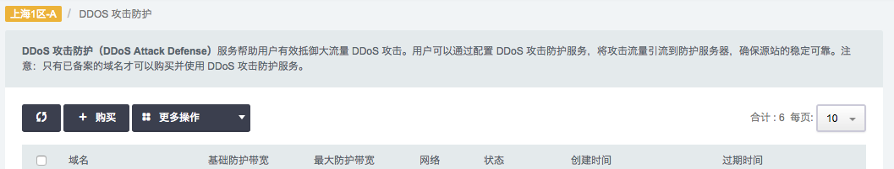
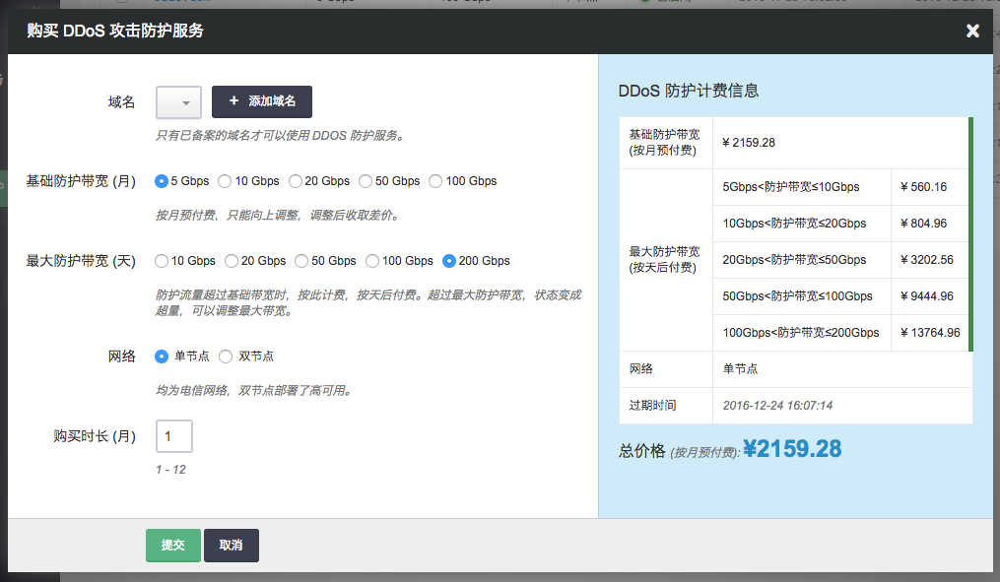
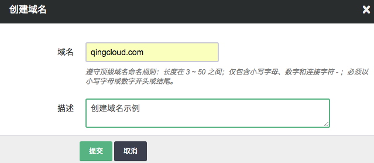
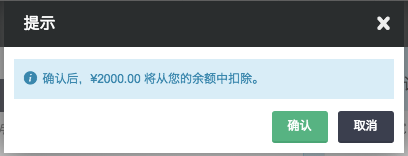

## 创建DDOS防护

**第一步：购买服务**

在控制台产品服务列表打开 **安全服务** 中的 **DDoS 攻击防护** 进入如下界面

点击 **购买** 进入如下界面

在创建的对话框中，点击 **添加域名** ，输入自己的主域名，如果已经添加过，可以跳过。

注解

该域名是主域名 如：我们为 ddos.qingcloud.com 添加防护，他的主域名是 qingcloud.com 。

请根据需要选择合适的基础防护带宽和最大防护带宽，DDoS 攻击防护服务收费规则如下：

*   基础防护带宽按月预付费，购买后只能升级，升级后收取差价；
*   DDoS 防护带宽未超过基础防护带宽时，按照基础防护带宽进行计费；
*   DDoS 防护带宽超过基础防护带宽未到最大防护带宽时，按照最大防护带宽进行防护，并按天扣相应流量费；
*   DDoS 防护带宽超过最大防护带宽时，DDoS 攻击防护服务会被禁用，状态变成超量，如果需要重新启用，则需要调整最大防护带宽，最大防护带宽一天只能调整一次。

目前我们提供了电信单节点和电信双节点服务，购买后如需修改，只能等到防护服务到期之后通过工单联系我们进行修改。

点击“提交”后，确认您需要付费的金额。

**第二步：配置服务**

点击您的域名进入防护服务详细页面进行配置。在“域名记录”列表中，您可以添加并启用需要进行防护的子域名。

注解

子域名指除去主域名的部分 如: ddos.qingcloud.com 中的 ddos

注解

防护回源地址必须是标准公网IP地址，不允许多IP地址回源，如果源站是域名或者多IP地址的，必须修改为单IP地址。 默认为 HTTP 防护，如果有需要使用 TCP 防护, 请工单联系我们进行修改。

开启 HTTPS (可选)

如需开启 HTTPS 则点击 “开启 HTTPS 服务”，在证书列表选择一个要使用的证书， 点击创建证书可上传自己网站的证书和密钥。

**第三步：配置 DNS 解析**

登录您的域名服务供应商网站，修改域名解析。此处以 DNSPod 为例：

登录 DNSPod，可查看到原来的域名记录。删除（或暂停）www 的 A 记录

如下图，www 的 A 记录已经暂停：

在 DNSPod 重新配置 www 的 CNAME 记录，记录值则指向青云提供的 CNAME 值。如下图：

保存，并耐心等待生效。CNAME修改生效一般需要1-2个小时。

**第四步：查看监控**

在 DNS 记录生效后，此时访问网站应该可以在监控中看到连接数的变动。

注解

各项统信息会有 5 分钟左右的延时

连接数监控

流量监控

## FAQ

**为什么采用CNAME接入**

CNAME接入优点：生效时间更快，且操作简单，适合正在遭受攻击的网站使用。

**使用 DDoS 防护后如何获取用户真实 IP**

如果是 HTTP 协议，可以从 Header 中的 X-Real-IP 获取真实 IP。

**被攻击后如何接入**

当遭遇攻击时，通过以下步骤使用防护服务：

1.  为您的域名购买防护服务
2.  将原 IP 解绑，申请并绑定新的 IP
3.  在青云控制台添加相应的记录与 IP
4.  修改旧的域名解析到新的 CNAME 上
