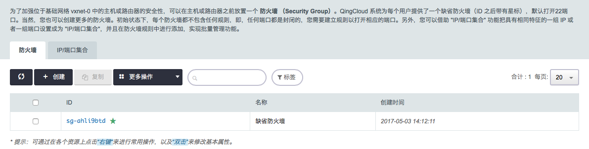
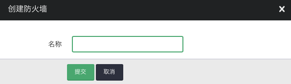
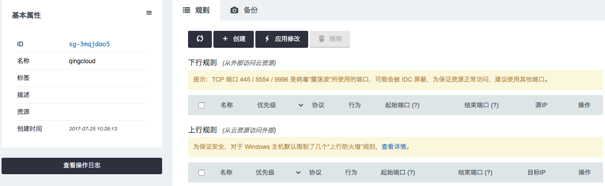

为了加强位于基础网络 vxnet-0 中的云服务器或路由器的安全性，可以在云服务器或路由器之前放置一个安全组(Security Group)。

## 前提条件

- QingCloud 系统为每个用户提供了一个缺省安全组(ID 之后带有星标)，默认打开22端口。
- 初始状态下，每个安全组都不包含任何规则，即任何端口都是封闭的，您需要建立规则以打开相应的端口。
- 您可以借助 "IP/端口集合" 功能把具有相同特征的一组 IP 或者一组端口设置成为 "IP/端口集合"，并且在安全组规则中进行添加，实现批量管理功能。
- 安全组可以绑定的实例类型为vpc/lb/nat/app集群。

## 操作步骤

点击 **安全** 中的 **安全组** 进入如下界面

> 注解：QingCloud 系统为每个用户提供了一个缺省安全组(ID 之后带有星标)，默认打开22端口。也可以创建更多的安全组

点击 **创建** 跳出如下界面

在名称框里输入创建的安全组名称，点击 **提交** ，点击创建的安全组进入如下界面

左侧**基本属性**栏记录了安全组ID、安全组名称、标签、描述、资源以及创建时间。

点击**基本属性**旁边的菜单按钮，可对安全组进行**修改**、**应用安全组规则**、**标签绑定/解绑**、**添加到项目**、以及**删除**的操作。

