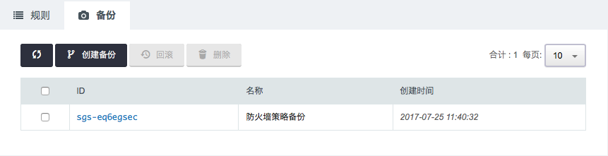

### 创建安全组策略

在安全组页面点击 **添加规则** ，跳出如下界面：

填写规则名称、优先级(数字越小优先级越高，最多可添加100条规则)，选择方向、行为(支持)、协议(支持多协议设置)，填写起始端口(可点击右侧标志，选择IP/端口集合)、结束端口、源IP(不填表示所有IP地址，可点击右侧标志，选择IP/端口集合)。支持快捷方式，快速配置ping、ssh、http等规则。

配置上行、下行规则，点击 **应用修改** ，规则生效，界面如下

点击每条规则的最右侧 **操作** 栏，可以禁止或启用该条规则。上行规则列表和下行规则列表上方有**修改**  **删除** 按钮，选择某条规则 点击按钮可以修改或删除规则。

### 创建安全组策略备份

点击页面上侧的 **备份** 按钮，进入如下界面

点击 **创建备份** ，跳出如下界面

填写备份名称，点击 **提交**，进入如下界面

选择备份策略再点击上侧 **回滚** 或鼠标右击备份策略选择 **回滚**，亦或鼠标左击备份策略，跳出如下界面

点击页面中左侧 **开关** 按钮，“开”表示与当前安全组对比，界面如下

> 注解：页面下侧表示的不同颜色代表着不同的规则

再次点击页面中左侧 **开关** 按钮，关闭备份规则与当前规则的对比。

点击 **回滚** ，跳出如下界面

点击 **确认** ，备份规则会自动覆盖当前规则。

