## 新建 WAF

WAF(Web 应用防火墙) 是跟负载均衡器（LoadBalancer）一起部署的，所以新建 WAF 需要新建负载均衡器并对其配置。 WAF 的策略配置项在这里可以修改，下面会分别讲到。

 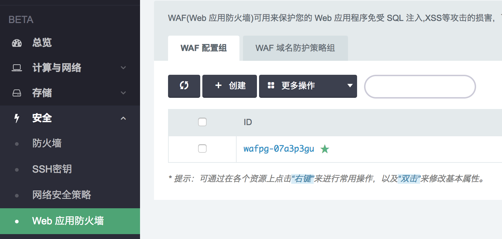

**第一步：创建一个负载均衡器**


首先，您需要创建一个负载均衡器。 在创建的对话框中点击**显示高级选项**，可以选择是否开启 WAF ，开启 WAF 之后会选择要求绑定一个全局配置组。
 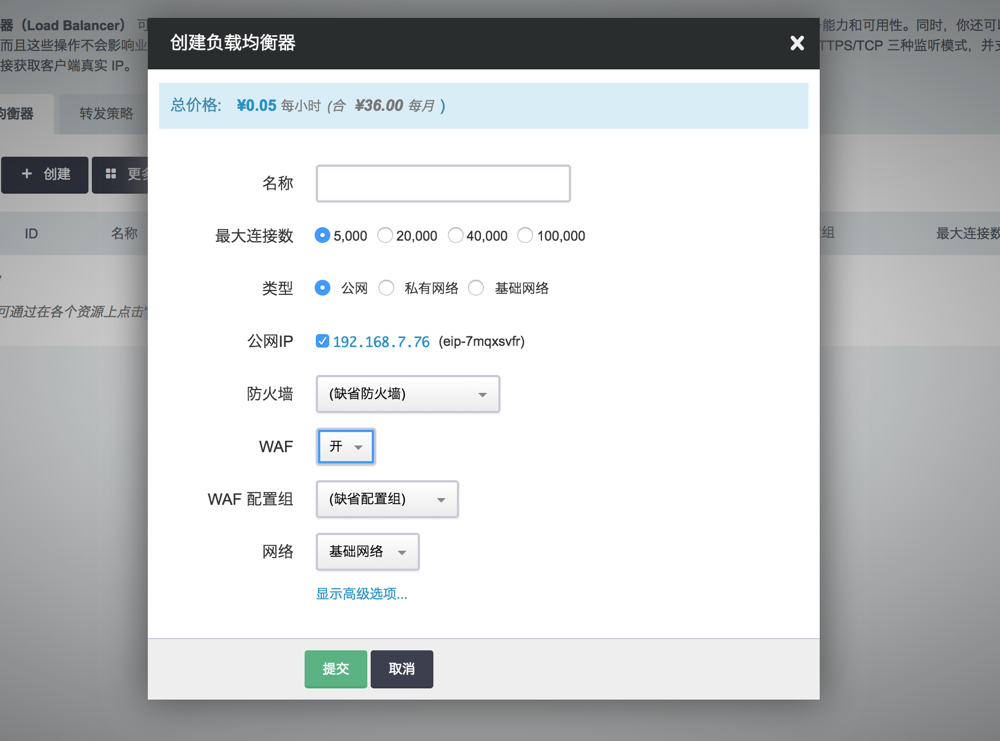

> 注解:开启 WAF 需要额外的计算资源, 请选择最大连接数 20000 及以上的规格。


**第二步：新建监听器**

当负载均衡器创建完成之后，我们需要新建一个 HTTP/HTTPS 协议的监听器。 监听器建好之后，可以给其配置 WAF 域名防护策略。

 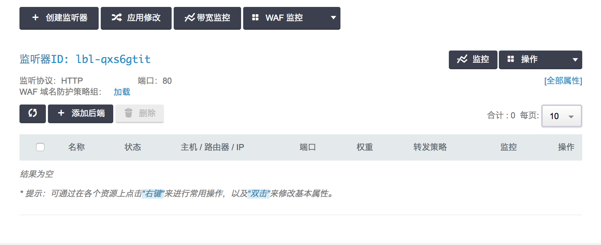

点击 WAF 域名防护策略组 “加载” 可以弹出 WAF 域名防护策略的选择页面：

 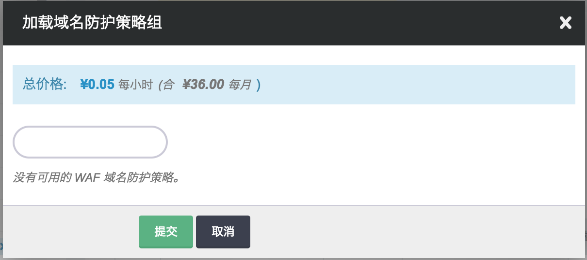

目前没有配置 WAF 域名防护策略，所以这里是空的。


**第三步：配置 WAF 域名防护策略**

WAF 的防护是以域名为单位，可以针对指定的域名配置具体的策略， 当 WAF 收到 HTTP/HTTPS 请求时，先判断域名是否在保护列表中，命中域名则进行后续的内容检查。 一个监听器可以配置最多 100 个域名防护策略。 选择 Web 应用防火墙，在 WAF 域名防护策略组里可以新建防护策略

 

  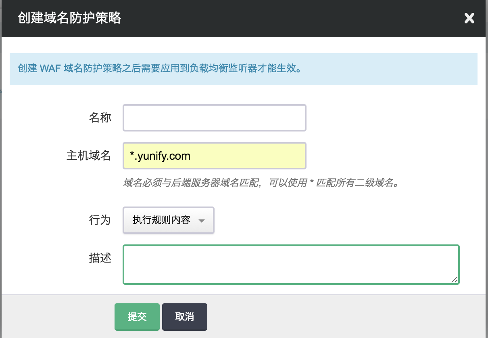


> 注解 云服务器域名为必填项，可使用 * 匹配所有二级域名，域名必须与后端服务器域名匹配。

 在 “行为” 一栏可以选择命中 WAF 规则时的响应动作，默认为执行规则内容，根据规则定义的动作来响应。 也可以配置为 “仅报告”，这样就是 “旁路观察” 模式，对命中规则的请求只记录日志不做阻断。


**第四步：配置 WAF 检测规则**

 创建好域名防护策略之后，WAF 就会加载系统的默认检测规则，这些规则由青云维护并更新：
 除了基于签名的规则防护之外，也可以选择基于语法的 SQLI 和 XSS 防护，开启这两个功能之前，可以配置为只记录日志观察一段时间。

 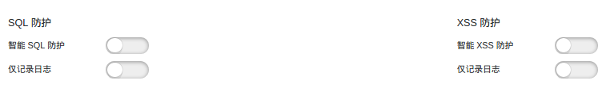

 用户也可以根据自己 Web 应用的特点，定制 WAF 检测规则，点击自定义规则下的 “创建” 可以弹出新建窗口：

 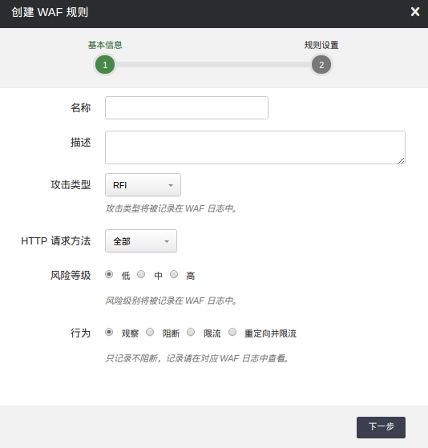

 规则的行为可配置为观察模式或者阻断模式，观察只记录不阻断对业务系统无影响，也可以配置限速限流。

> 注解: 新增规则时请配置为观察模式，待规则稳定之后再修改为阻断模式。

 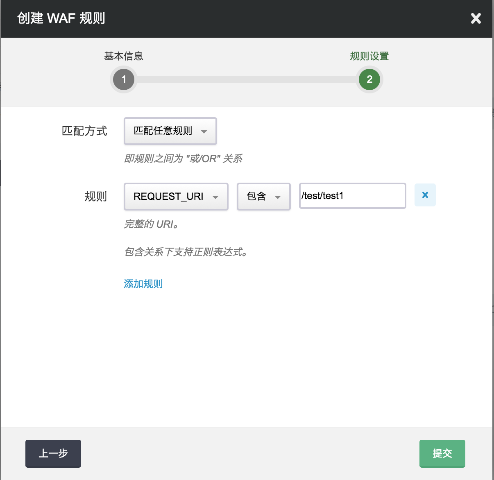

规则配置要填写要检测的 HTTP 协议字段内容，当前一条规则支持配置检查 5 个协议变量，提交修改之后可以看到填写的内容。

 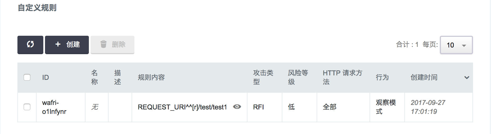

 除了可以配置自定义的规则，还可以配置自定义的黑白名单以及 CC 防护功能，点击 “黑白名单” 下的 “创建”：

 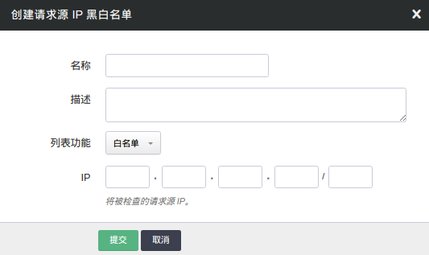


> 注解: 配置的 IP 是将被检查的请求源 IP，包含可选的子网掩码。

 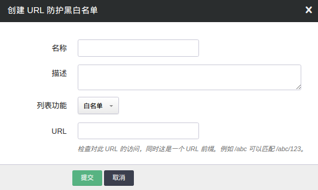

> 注解： 配置的 URL 将进行路径前缀匹配，例如 /abc 可以匹配 /abc/123。

 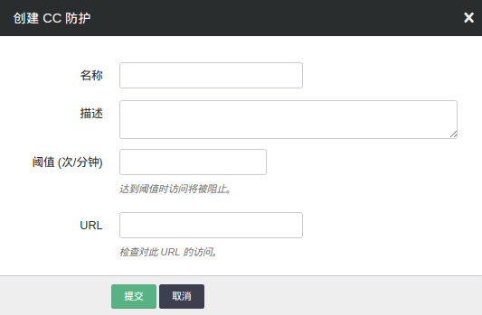


> 注解： 配置的 URL 将进行完全匹配，这里请填写完整的 URL 路径。

 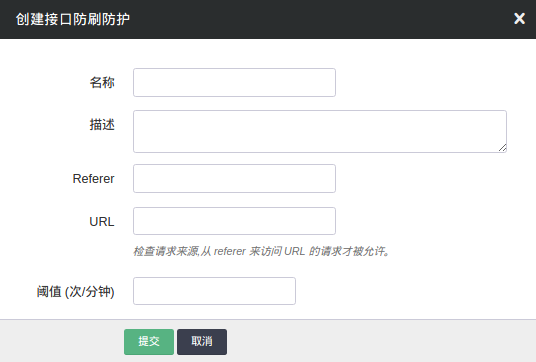


> 注解： 将检查 URL 的来源是否为配置的 REFERER, 不是则进行阻断。是则检查访问频率，超过阈值进行阻断。地址是前缀匹配，例如 /abc 可以匹配 /abc/123。

 配置完之后可以看到规则列表：

 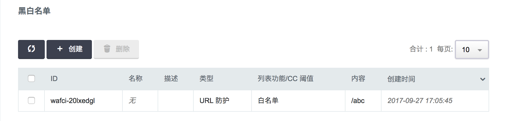

**第五步：绑定 WAF 域名防护策略**

在第三步中给监听器配置 WAF 域名防护策略时，因为还没有创建 WAF 域名策略，所以弹出的列表是空的。 现在点击监听器下方的 WAF 域名防护策略 “加载” 按钮，可以列出来已创建的域名防护策略。

 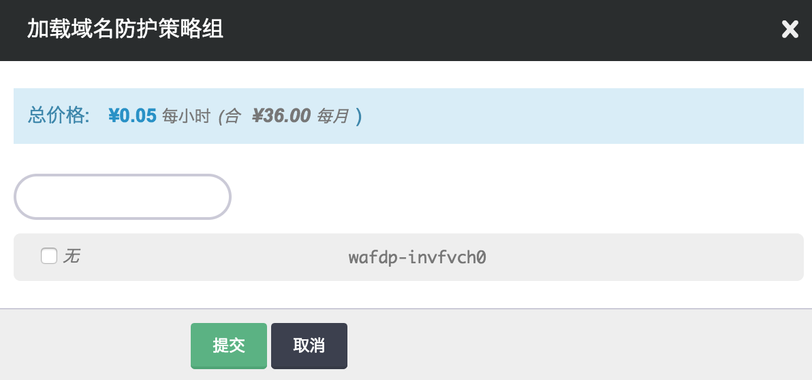

绑定之后，在监听器下方会列出来所加载的 WAF 域名防护策略：

 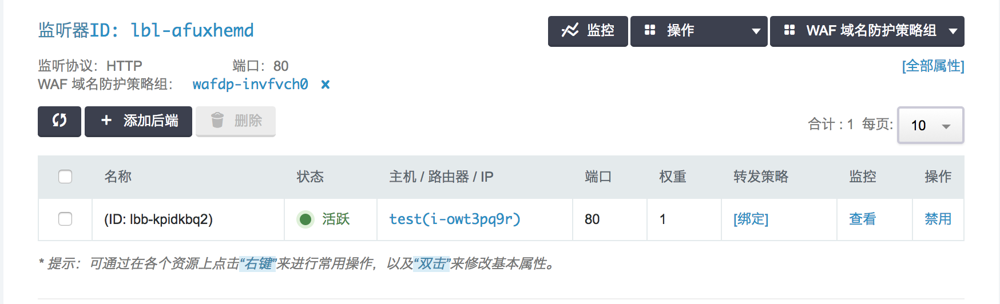

> 注解： 配置之后要点击负载均衡器的 “应用修改” 来更新。

 针对 WAF 操作的按钮也会单独列出来,可以在这里将 WAF 规则解绑，或者查看 WAF 的检测结果


**第六步：全局 WAF 配置组**

 WAF 配置组是针对负载均衡器的全局配置，这里可以针对 WAF 功能做微调，比如配置 WAF 日志发送的地址等，可修改的选项如下：

 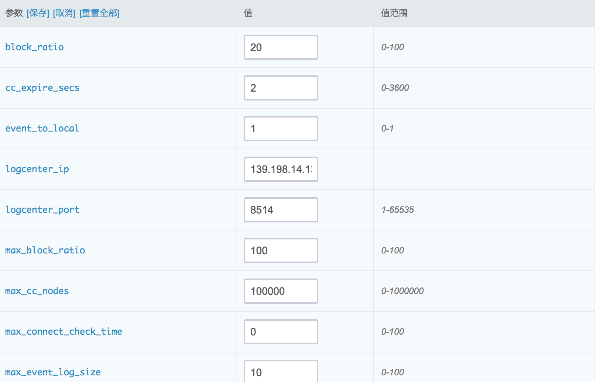

* **logcenter_ip**: WAF 的日志服务器地址，不填则不发送
* **logcenter_port**: WAF 的日志服务器端口
* **syslog_facility**: WAF 的 syslog facility
* **syslog_level**: WAF 的 syslog level
* **event_to_local**: 是否在本地记录 WAF 日志，0 不记录
* **max_local_event_num**: 本地记录的 WAF 的日志最大条目
* **max_cc_nodes**: 支持检测的 CC 节点的数量
* **cc_expire_secs**: CC 检测的节点超时时间
* **cc_block_ratio**: CC 检测的阻断惩罚速率
* **cc_suspect_ratio**: CC 检测的可疑惩罚速率
* **max_block_ratio**: 系统最大阻断率
* **max_connect_check_time**: 系统保活探测次数
* **max_system_ratio**: WAF 最大资源利用率
* **module_cc_enable**: 是否开启 CC 功能，0 不开启
* **module_check_enable**: 是否开启规则检查功能，0 不开启
* **module_iplist_enable**: 是否开启 IP 黑白名单功能，0 不开启
* **module_urllist_enable**: 是否开启 URL 黑白名单功能，0 不开启

> 注解: 配置之后要点击 “应用修改” 来更新。


**第七步：查看 WAF 监控日志**

 开启 WAF 之后可以查看检测的监控统计，在监听器的右边点击 WAF 的按钮选择 “监控”：

 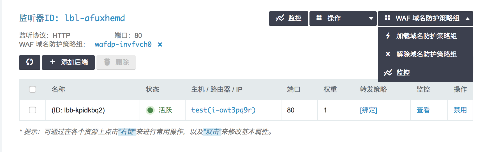

  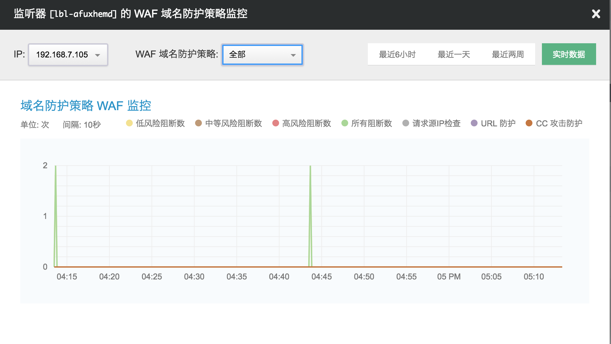

这里是针对每个监听器，按命中的规则和黑白名单来分别统计。

也可以查看整个负载均衡的监控情况，点击 “WAF监控” 选择 “监控”:

 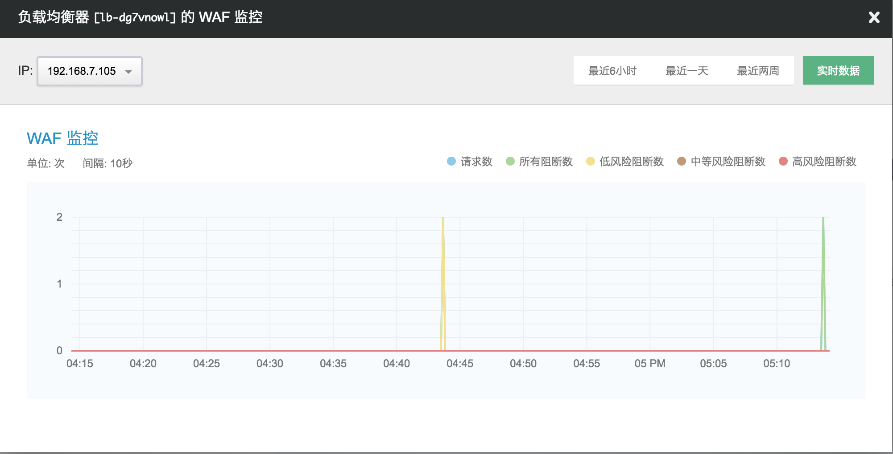

 点击 “WAF监控” 选择 “日志” 可以查看本地保存的攻击日志:

 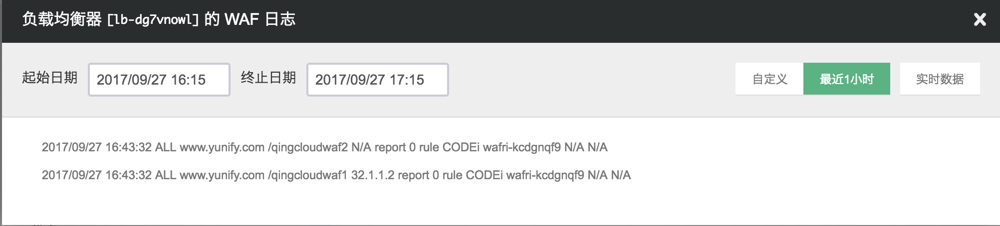


> 注解:本地日志默认保存 2000 条，要保存更多日志可以配置 WAF 的日志服务器，WAF 的检测日志可以通过 syslog 的方式发送出去。

 WAF 的日志可以通过syslog的格式发送到日志服务器，可以修改配置组中的 **logcenter_ip** 和 **logcenter_port** 参数来配置。 同时，可以将日志倒入 ELK 来分析处理，需要使用 **logstash-input-syslog** 来接收syslog日志，并配置 grok 过滤参数如下：
```
 grok {
 match => { “message” => “%{WORD:method} %{HOSTNAME:domain} %{URIPATHPARAM:url} %{NOTSPACE:client_ip} %{WORD:action} %{INT:impact} %{WORD:module} %{NOTSPACE:attack_type} %{NOTSPACE:rule_id} %{NOTSPACE:ua} %{GREEDYDATA:post}” }
 }
```

 可配置的 dashboard 效果如下：

 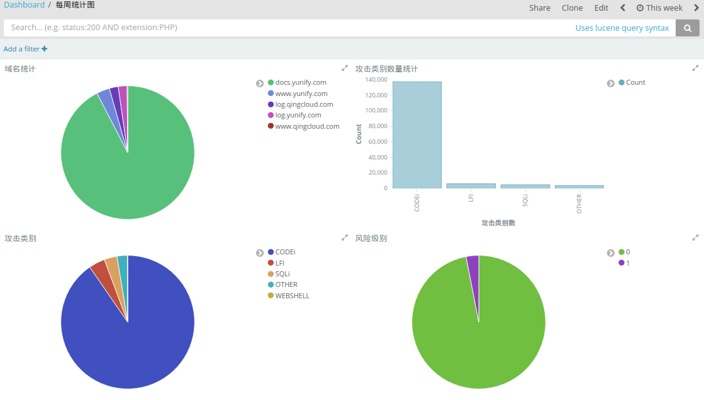

## 关闭 WAF

 已经创建好的 WAF 如果要关闭，需要先解绑监听器上绑定的域名防护策略：

 

 然后右键点击负载均衡器，可以看到 “禁用 Web 应用防火墙” 的选项：

 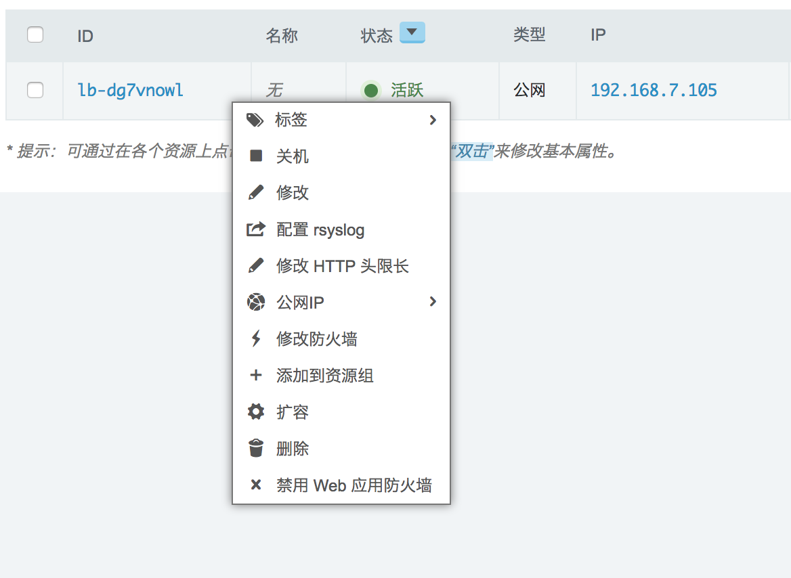

> 注解: 配置之后要点击负载均衡器的 “应用修改” 来更新。


## 开启 WAF

给已经创建好的负载均衡器开启 WAF 功能时，右键点击负载均衡器，可以看到 “开启 Web 应用防火墙” 的选项：

 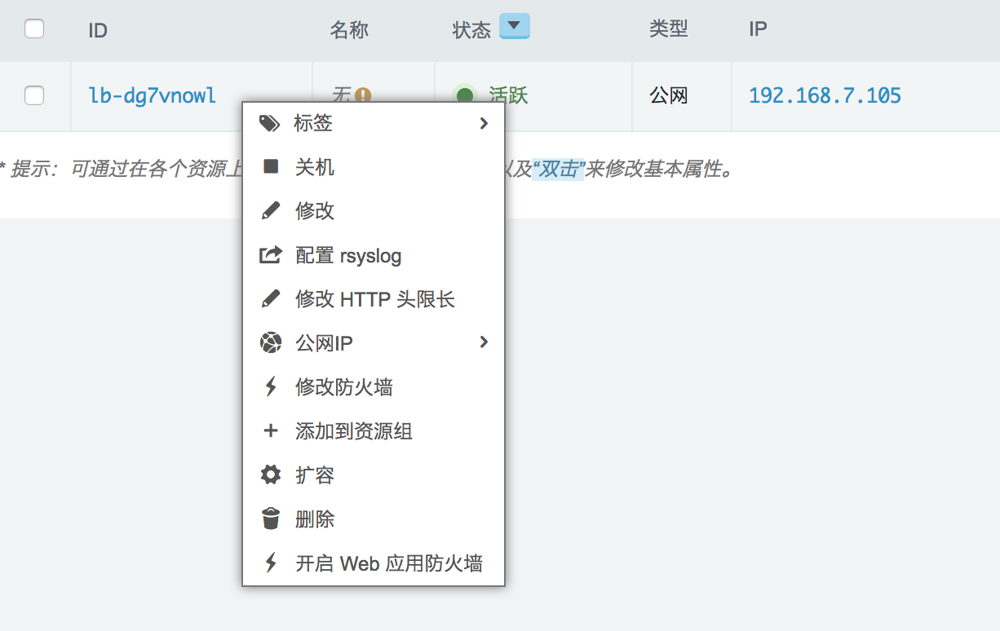

弹出让我们选择 WAF 配置组的选项：

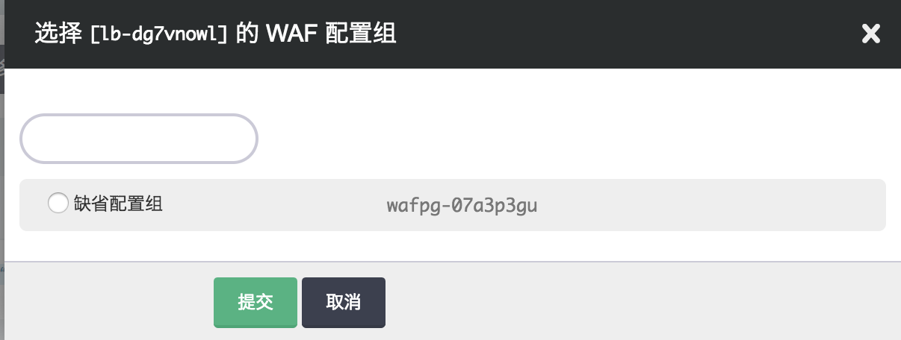

如果当前负载均衡器的版本太低，会提示进行升级，需要先关闭然后再开启负载均衡器：

 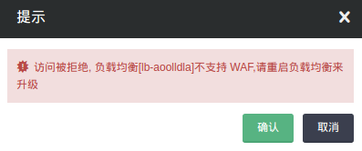

开启 WAF 功能之后，需要给监听器绑定域名防护策略，步骤同上。


> 注解: 配置之后要点击负载均衡器的 “应用修改” 来更新。


## 性能

WAF 需要做规则匹配，所以需要更多的 CPU 处理时间和内存，QPS 也有少许下降：

* **CPU**: 根据规则数量和请求的不同 CPU 的使用率有 2% - 30% 的升高
* **内存**: 根据规则数量和请求的不同需要 128M 以上的内存
* **QPS**: 根据规则数量和请求的不同 QPS 有 4% - 10% 的下降

> 注解： 该数据仅供参考，可根据自己的业务系统做测试来获得第一手资料。
