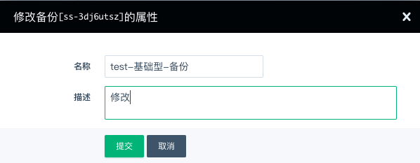
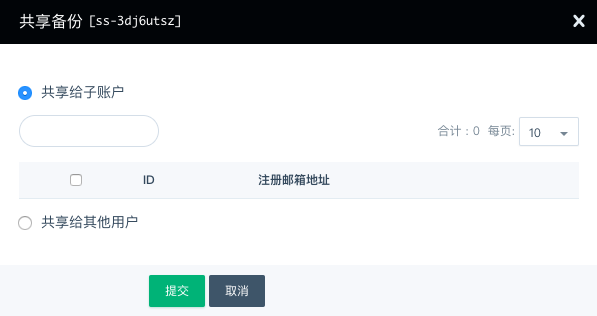
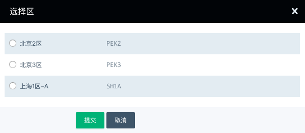

## 进入备份页面

1. 登录管理控制台。
2. 在控制台导航栏中，选择**产品与服务** > **存储服务** > **备份**，进入**备份**页面。

## 修改备份名称或描述

1. 在备份链列表所在行右键单击，选择**修改**。

2. 输入修改后的名称及描述，点击**提交**。

   

## 共享备份

云硬盘备份可共享给子账号或共享给其他账号。

1. 在备份链列表所在行右键单击，选择 **共享备份**。

   

2. 选择要共享给的子账号或填写要给共享的其他用户 ID/ 注册邮箱地址，点击 **提交**。

3. 点击备份链ID号，可以看到共享列表，显示已添加成功的共享账号列表。

## 跨区复制备份

1. 在备份链列表所在行右键单击，选择**跨区复制备份**。

   

2. 选择要复制到区域，点击**提交**。

