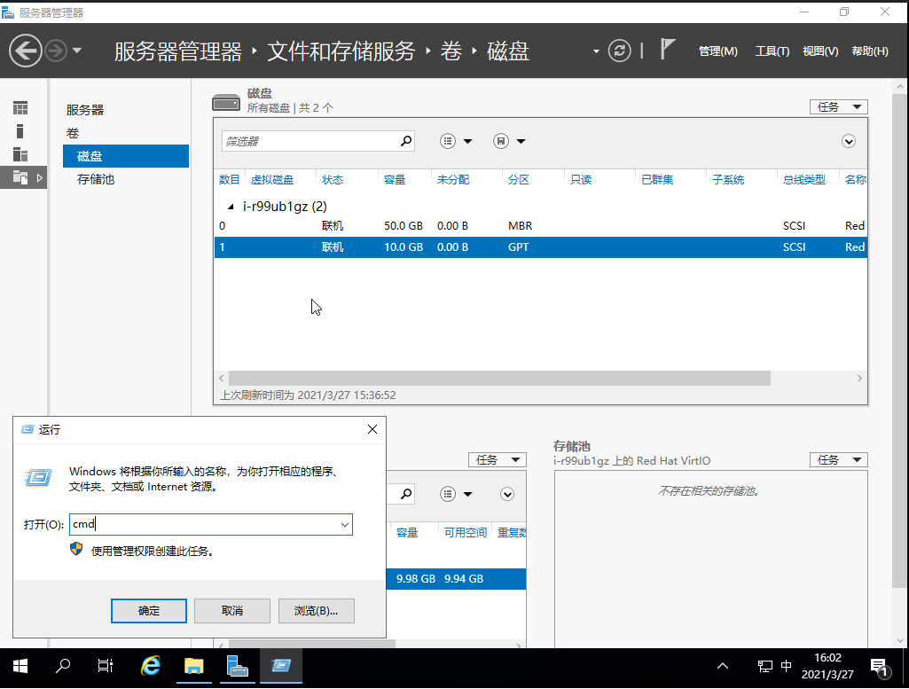
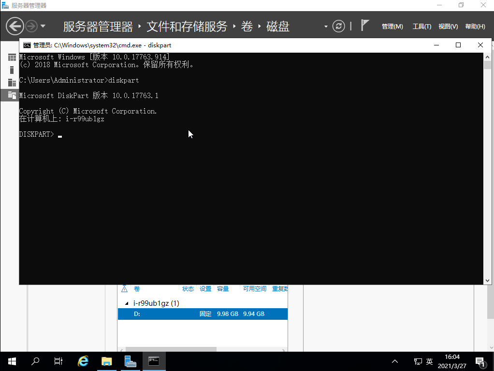
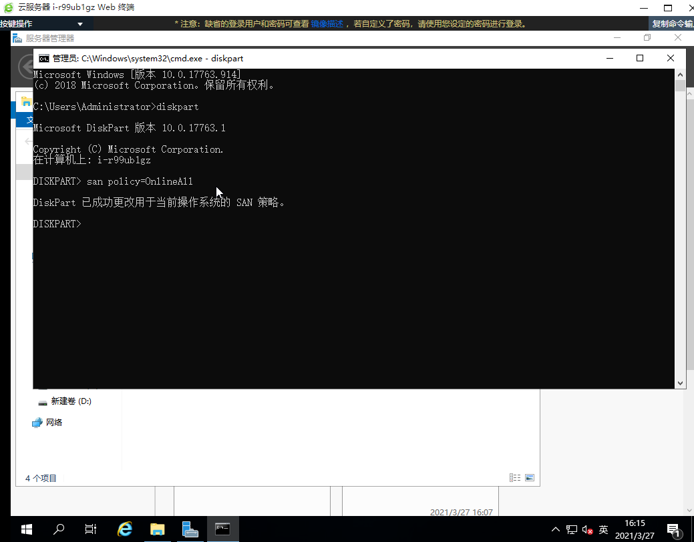

Windows 云服务器挂载硬盘之后，如果云服务器发生重启，硬盘可能没法自动挂载，需要人工登录并进行手动 “联机” 操作， 以下方法可以帮助您设置硬盘自动挂载。

1. 打开 Windows 命令行工具, 即 cmd

   

2. 运行 `diskpart`，进入diskpart交互模式。。

   

3. 输入`san policy=OnlineAll`
   

   至此， Windows 硬盘自动挂载设置完成。

