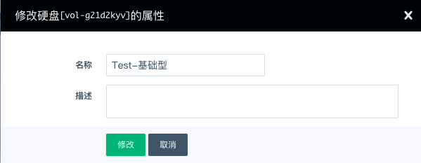
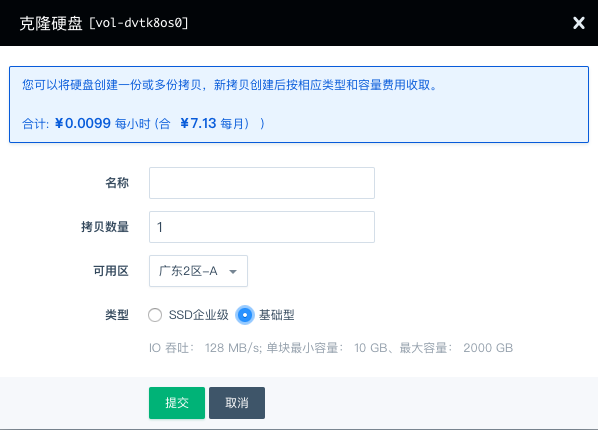
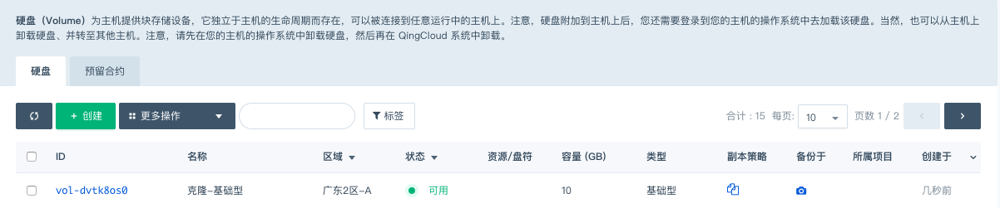
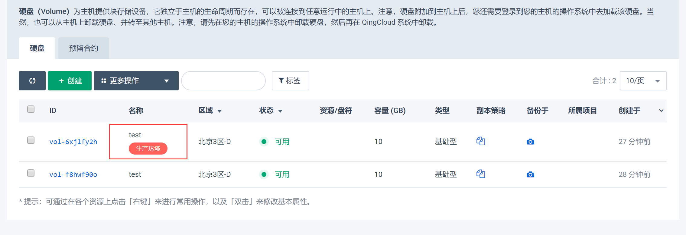
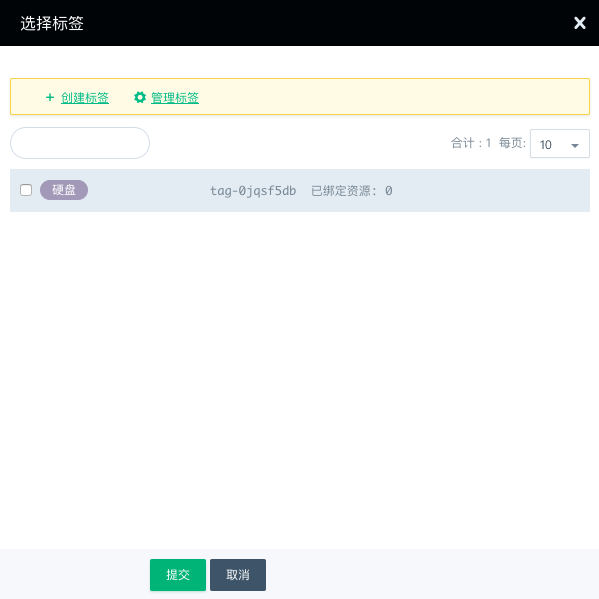
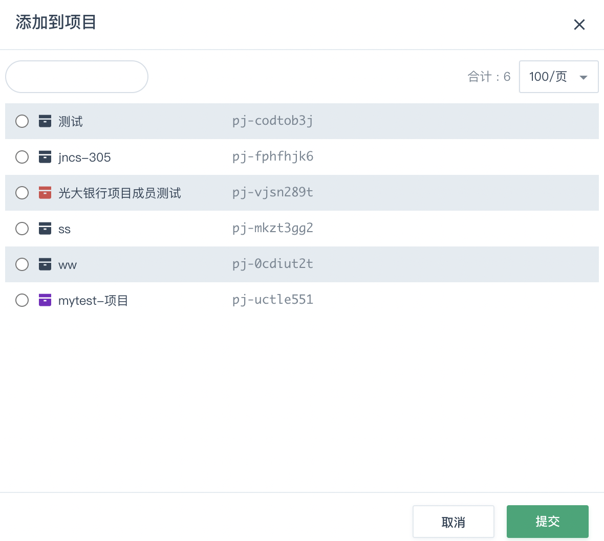

## 进入硬盘页面

1. 登录管理控制台。
2. 在控制台导航栏中，选择**产品与服务** > **存储服务** > **云硬盘**，进入**硬盘**页面。

## 创建硬盘

请参见[创建云硬盘](/storage/disk/quickstart/create_disk/)。

## 修改硬盘属性

1. 在云硬盘列表右键点击需要修改的硬盘，选择**修改**，弹出**修改硬盘[*硬盘ID*号]属性**界面。

   

2. 编辑硬盘的属性，包括名称和描述，然后点击**修改**。

## 克隆硬盘

1. 在云硬盘列表右键点击需要克隆的硬盘，选择**克隆硬盘**，弹出**克隆硬盘**界面。

   

2. 输入**名称**、**拷贝数量**，选择**可用区**及**类型**，点击**提交**。

   当状态显示为“可用”时，表示克隆成功。

   

   > **说明**：
   >
   > • 基础型及SSD企业级硬盘可克隆为基础型或SSD企业级硬盘。
   >
   > • 容量型硬盘及企业级分布式SAN(NeonSAN) 只可克隆为同类型的硬盘。

## 扩容硬盘

1. 在云硬盘列表右键点击需要扩容的硬盘，选择**扩容**，弹出**扩容硬盘**界面。

   

2. 拖动容量滑块或直接输入容量值，点击**提交**即可。

## 硬盘标签

标签用于标识云资源，可通过标签实现对云硬盘资源的分类和搜索。

### 创建标签

1. 在**硬盘**页面，点击**标签**，选择**创建标签**。

2. 输入标签名称，选择标签颜色，点击**提交**。

   

###  绑定标签

1. 在云硬盘列表右键点击需要绑定标签的硬盘，选择**标签** > **绑定**，弹出**选择标签**页面。

   

2. 在标签列表中勾选想要绑定的标签，点击**提交**。

   绑定成功后，可在硬盘名称列显示已绑定的标签。

### 解绑标签

1. 在云硬盘列表右键点击需要解绑标签的硬盘，选择**标签** > **解绑**。

2. 勾选需要解绑的标签，点击**提交**。

### 修改与删除标签

1. 在**硬盘**页面，点击**标签**，选择**标签管理**，进入**标签**页面。

2. 右键点击需要修改或删除的标签，即可进行修改或删除操作。

   

## 加入项目

1. 在云硬盘列表右键点击需要加入到项目的硬盘，选择**项目** > **加入**，弹出**添加到项目**页面。

   

   > **说明**：若还未创建项目，可参考[项目使用](/operation/project/manual/management/)进行创建。

2. 选择需要添加到的项目，点击**提交**，即可将硬盘添加到该项目。

   添加完成后，在硬盘列表可以查看硬盘所属的项目，如下图。

   

## 硬盘监控

硬盘挂载到云服务器后，点击硬盘条目，便可查看硬盘监控情况。

硬盘 IOPS 及硬盘吞吐量实时监控数据默认为关闭状态，点击右侧关闭按钮便可切换为开启状态，查看硬盘 IOPS 和吞吐量实时数据。默认显示最近6小时数据，可选择查看最近一天、最近两周、最近一个月和最近6个月的数据。

还可点击硬盘使用率右侧的 **查看监控图** 来查看硬盘使用率。

> **说明**：硬盘需要格式化并挂载到文件系统后，才可查看到硬盘使用率情况。

