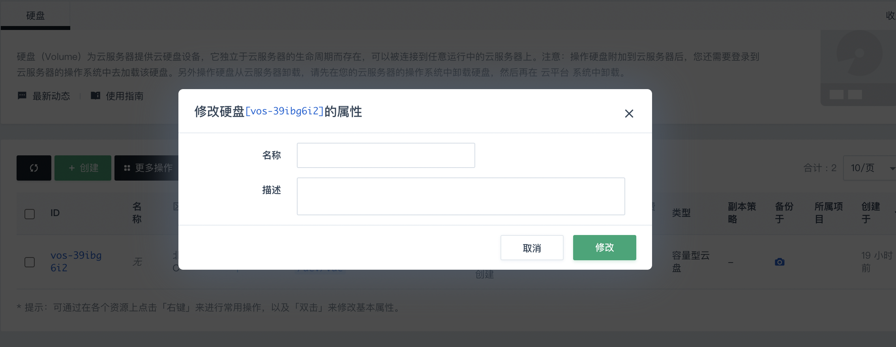
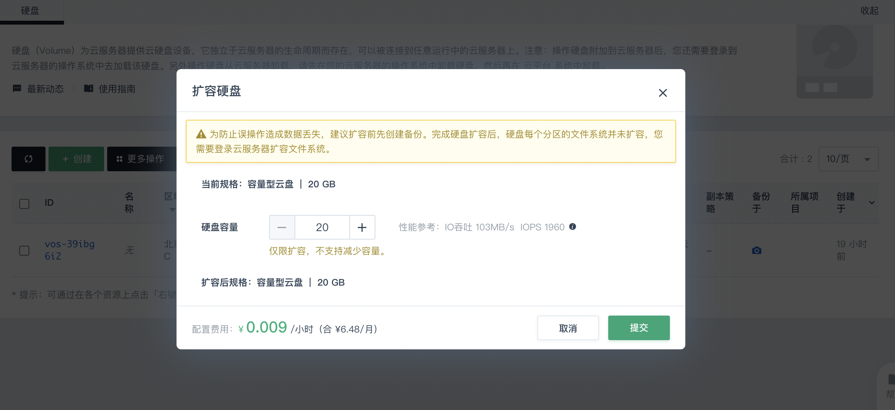
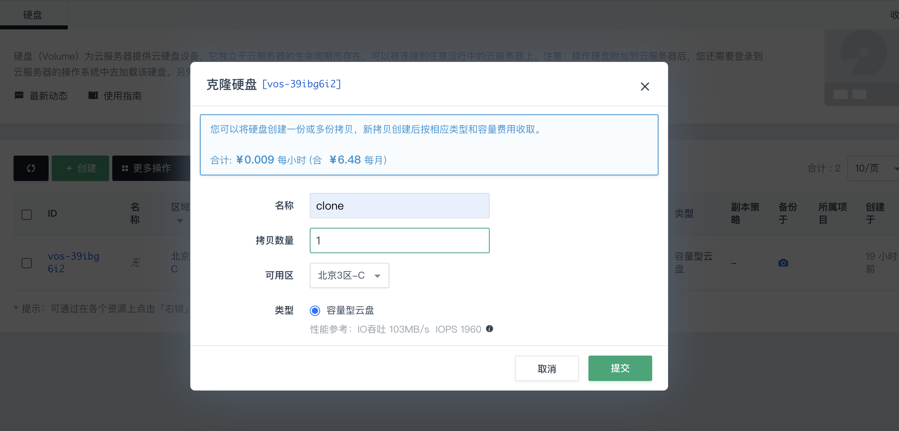
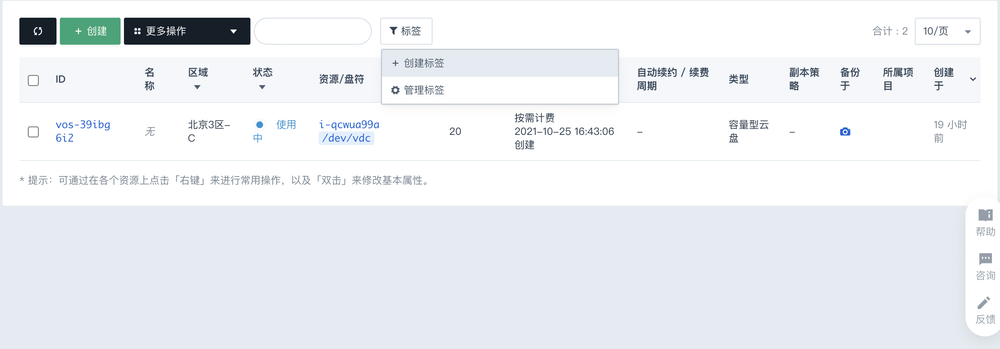
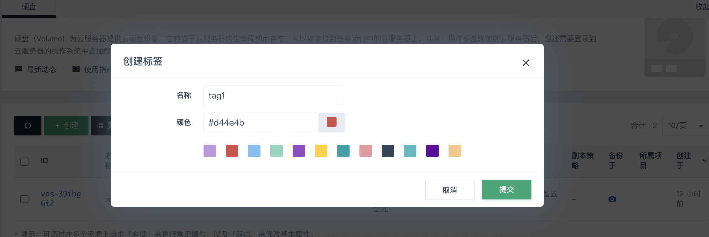
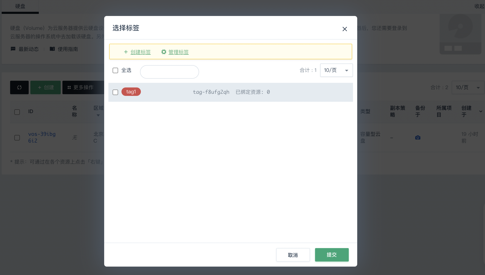
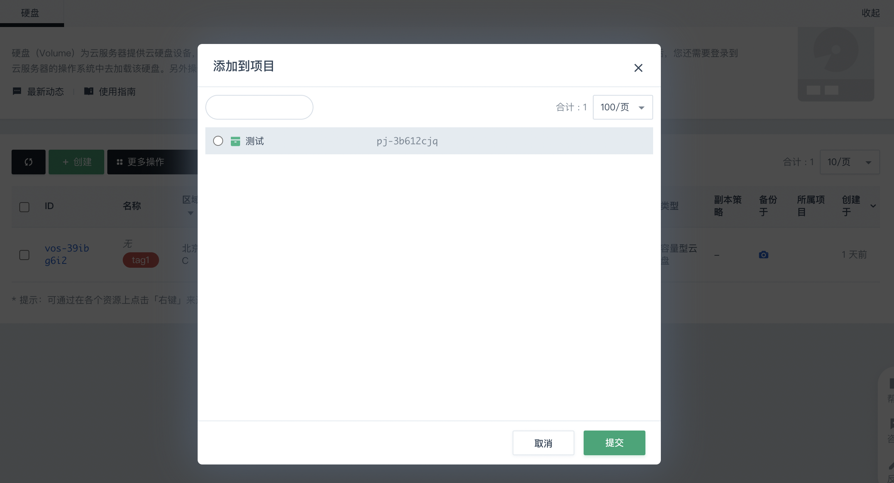

## 进入硬盘页面

1. 登录 [QingCloud 管理控制台](https://console.qingcloud.com/login)。
2. 在控制台导航栏中，选择**产品与服务** > **存储服务** > **云硬盘**，进入**硬盘**页面。

## 创建硬盘

请参见[购买硬盘](/storage/disk/quickstart/create_disk/)。

## 修改硬盘属性

1. 在云硬盘列表右键点击需要修改的硬盘，选择**修改**，弹出**修改硬盘[*硬盘ID*号]属性**界面。

   

2. 编辑硬盘的属性，包括名称和描述，然后点击**修改**。

## 扩容硬盘

1. 在云硬盘列表右键点击需要扩容的硬盘，选择**扩容**，弹出**扩容硬盘**界面。

   

2. 点击“+”或直接输入容量值进行扩容，点击**提交**即可。

## 克隆硬盘

1. 在云硬盘列表右键点击需要克隆的硬盘，选择**克隆硬盘**，弹出**克隆硬盘**界面。
   

2. 编辑克隆硬盘的属性，包括名称以及拷贝数量，点击**提交**即可。

## 硬盘标签

标签用于标识云资源，可通过标签实现对云硬盘资源的分类和搜索。

### 创建标签

1. 在**硬盘**页面，点击**标签**，选择**创建标签**。
   

2. 输入标签名称，选择标签颜色，点击**提交**。
   
   

###  绑定标签

1. 在云硬盘列表右键点击需要绑定标签的硬盘，选择**标签** > **绑定**，弹出**选择标签**页面。

   

2. 在标签列表中勾选想要绑定的标签，点击**提交**。

   绑定成功后，可在硬盘名称列显示已绑定的标签。

### 解绑标签

1. 在云硬盘列表右键点击需要解绑标签的硬盘，选择**标签** > **解绑**。

2. 勾选需要解绑的标签，点击**提交**。

## 加入项目

1. 在云硬盘列表右键点击需要加入到项目的硬盘，选择**项目** > **加入**，弹出**添加到项目**页面。

   

   > **说明**：
   >
   > 若还未创建项目，可参考[项目使用](/operation/resource/manual/project/management/)进行创建。

2. 选择需要添加到的项目，点击**提交**，即可将硬盘添加到该项目。

   添加完成后，在硬盘列表可以查看硬盘所属的项目，如下图。

   

## 硬盘监控

硬盘挂载到云服务器后，点击硬盘条目，便可查看硬盘监控情况。

   

硬盘 IOPS 及硬盘吞吐量实时监控数据默认为关闭状态，点击右侧关闭按钮便可切换为开启状态，查看硬盘 IOPS 和吞吐量实时数据。默认显示最近6小时数据，可选择查看最近一天、最近两周、最近一个月和最近6个月的数据。

还可点击硬盘使用率右侧的 **查看监控图** 来查看硬盘使用率。

> **说明**：
>
> 硬盘需要格式化并挂载到文件系统后，才可查看到硬盘使用率情况。

## 删除硬盘

>**说明**：
>
>若硬盘已被加载到服务器，则删除硬盘前，需要先[卸载硬盘](/storage/disk/manual/unload/)。

1. 在硬盘列表，右键单击需要删除的硬盘，选择**删除**。
2. 在弹出的提示框中，单击**确认**。

## 硬盘预留合约

>**说明**：
>
>该页面仅对以往签署预留合约并且合约状态处于“生效中”或“OPEN期”的用户可见。

在硬盘列表，单击硬盘ID后的预留资源图标，进入硬盘绑定的预留合约详情页。

- 在页面上方，可查看合约生命周期，以及进行合约的续订、退订、配置调整等操作。

- 在页面下方的**预留资源**页签，可从合约中解绑现有硬盘资源或绑定其他硬盘资源。

  

