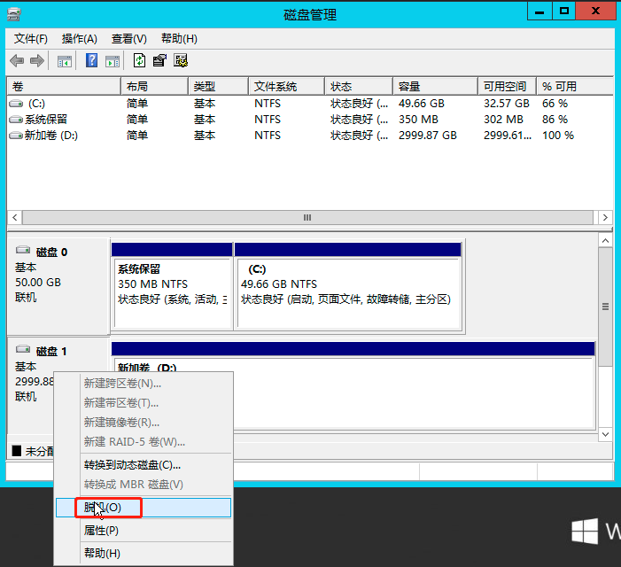

## 扩展云硬盘容量

1. 在桌面点击"开始 > 运行"，然后输入`diskmgmt.msc`，打开磁盘管理器。

2. 将磁盘的状态设置为脱机。

   

3. 登录控制台，进入硬盘页面，右键点击待卸载的硬盘ID，选择**卸载硬盘**，直至硬盘状态为可用。

   

4. 在云硬盘列表右键点击需要扩容的硬盘，选择**扩容**，弹出**扩容硬盘**界面。

   

5. 点击“+”或直接输入容量值进行扩容，点击**提交**即可。

6. 将扩容后的磁盘加载到云服务器。

7. 打开磁盘管理器，可以看到有未分配的磁盘容量。

   

##  扩展卷容量

1. 右键单击磁盘分区，选择【扩展卷】。

   

2. 根据扩展卷向导的指引完成扩展卷操作。

   

   

   

   完成后新增的数据盘空间将会合入原有卷中。

   

