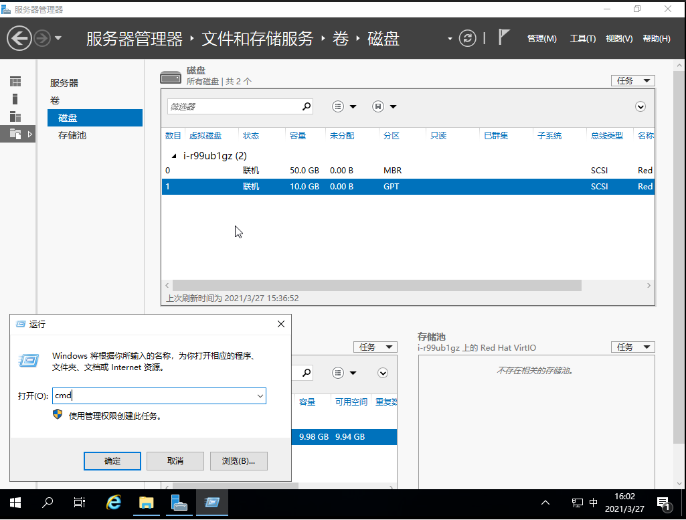
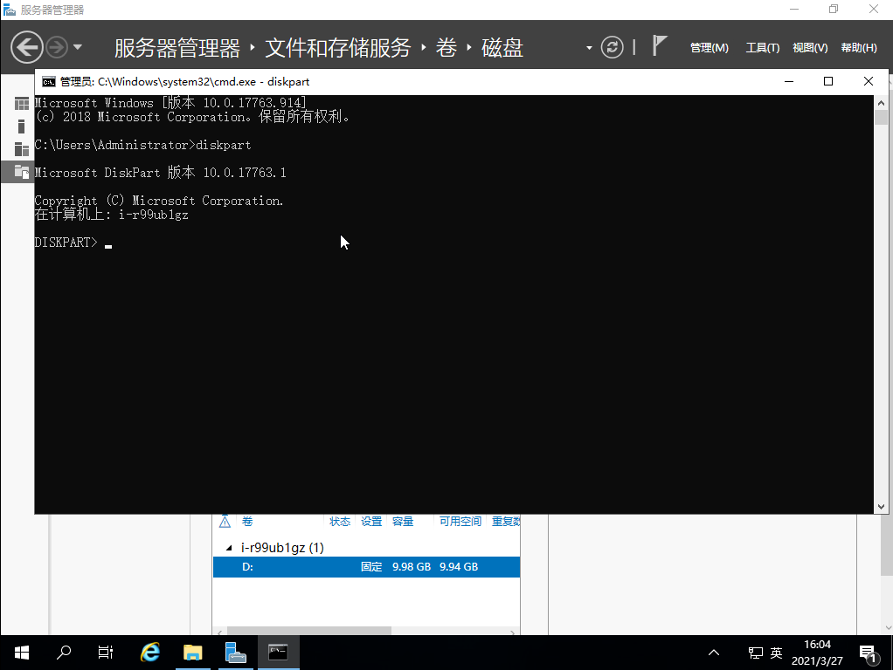
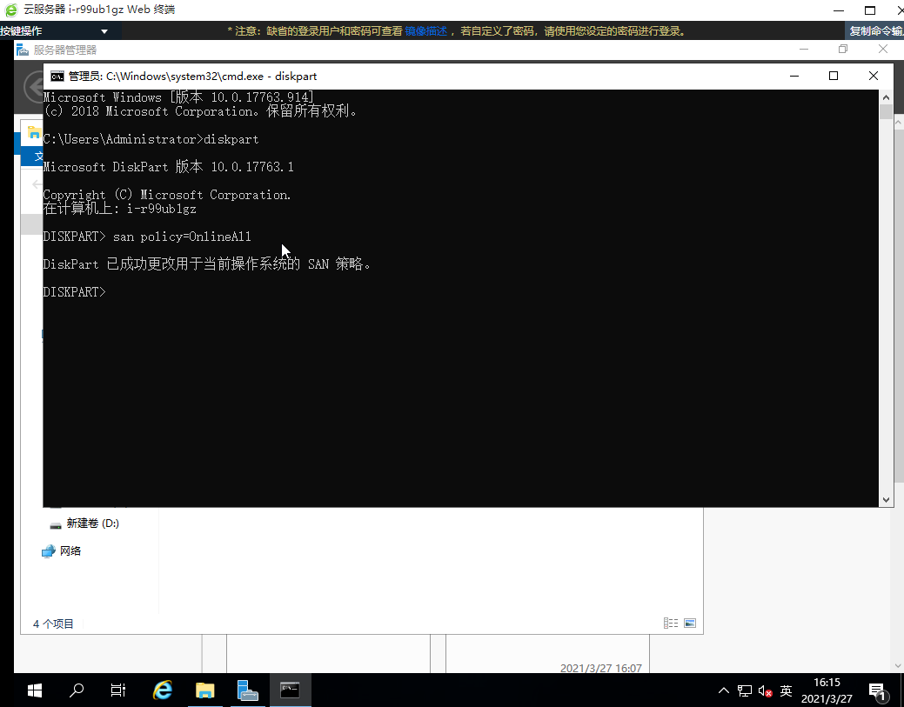

## 创建硬盘并绑定到云服务器

先在控制台创建硬盘并绑定到 Windows 云服务器上，可以参考如下链接：
[创建硬盘并绑定到云服务器](https://docsv3.qingcloud.com/storage/disk/manual/basic_volume/#第一步创建基础型硬盘)

加载硬盘到云服务器之后，我们需要登陆 Windows 云服务器先将硬盘格式化，可以参考如下链接：
[格式化磁盘](https://docsv3.qingcloud.com/storage/disk/quickstart/quick_start/#windows-%E6%93%8D%E4%BD%9C%E7%B3%BB%E7%BB%9F)

## 配置硬盘自动开机自动挂载
此时 Windows 云服务器挂载硬盘之后，如果云服务器发生重启，硬盘可能没法自动挂载，需要人工登录并进行手动 “联机” 操作， 以下方法可以帮助您设置硬盘自动挂载:

### 打开 Windows 命令行工具, 即 cmd 

### 运行 diskpart

### 进入diskpart交互模式
输入san policy=OnlineAll

至此，完成了设置 Windows 硬盘自动挂载。