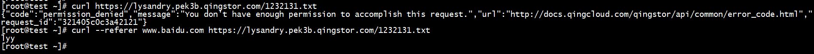

## 使用背景
ACL提供了 Bucket 级别的读写权限设置，权限包括可读、可写和可读写。你可以将不同的访问权限分别授予不同的青云用户，也可以选择所有用户整体设置。
存储空间策略 (Bucket Policy) 允许用户更细粒度的控制存储空间的访问。 其语义主要由用户、 资源、动作及条件运算符组合定义。例如仅允许指定用户以指定站点为 Referer 以下载存储空间中的某单个文件，或者防止外链等。
ACL过于广域，对于一些更细粒度的控制无法实现，需要用policy来实现访问控制。
**policy优先级大于ACL，也可以理解成pllicy不受acl控制,配置过程中需明确清楚两者优先级。**

## 常见案例
>以下是policy规则分别使用白名单和黑名单实现相同结果的两个案例，从案例中熟悉policy黑白名单的使用。最终实现的效果都是一样的，即header里的referer必须匹配 *.[baidu.com](http://baidu.com/) ，才能允许访问

### 案例一： ACL无任何规则

policy白名单（允许） referer 匹配 *.[baidu.com](http://baidu.com/) 访问

测试结果，如下:

直接curl访问提示无权限， --referer指定[www.baidu.com](http://www.baidu.com/)之后可以正常访问

可见，ACL不做任何规则限制（默认都无权访问），由于policy优先级更高，可以直接越过ACL的限制

### 案例二：ACL限制所有人可读

policy黑名单 （拒绝） referer 不匹配 *.[baidu.com](http://baidu.com/) ，如图:

测试结果，如下:

直接curl访问提示无权限， --referer指定[www.baidu.com](http://www.baidu.com/)之后可以正常访问

可见要实现的结果和 案例一 是一致的

