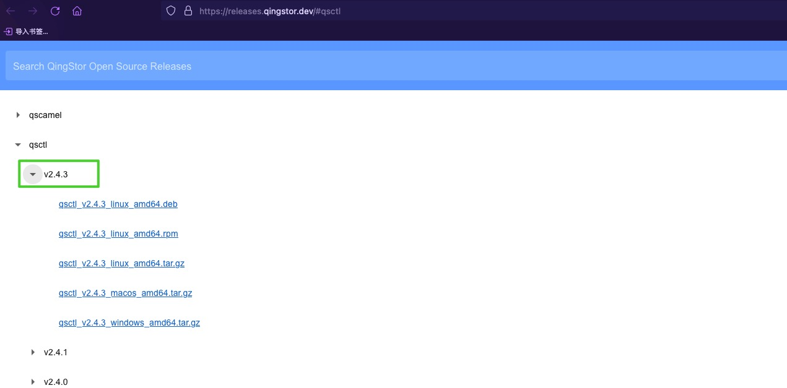
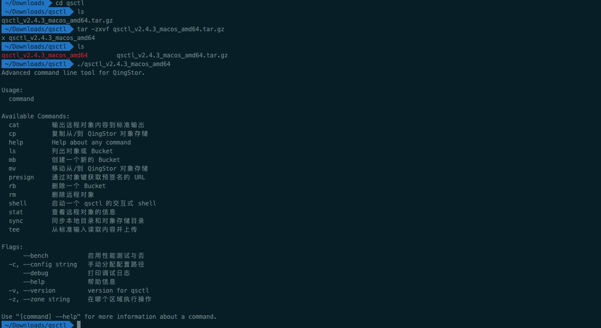
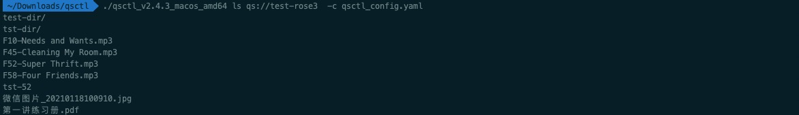
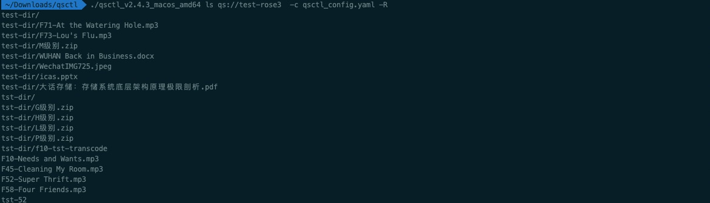
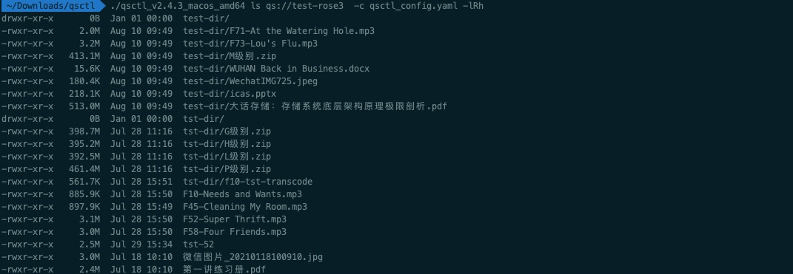
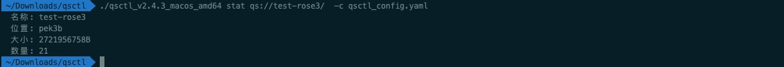
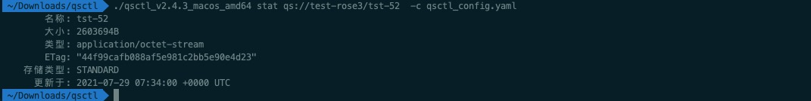
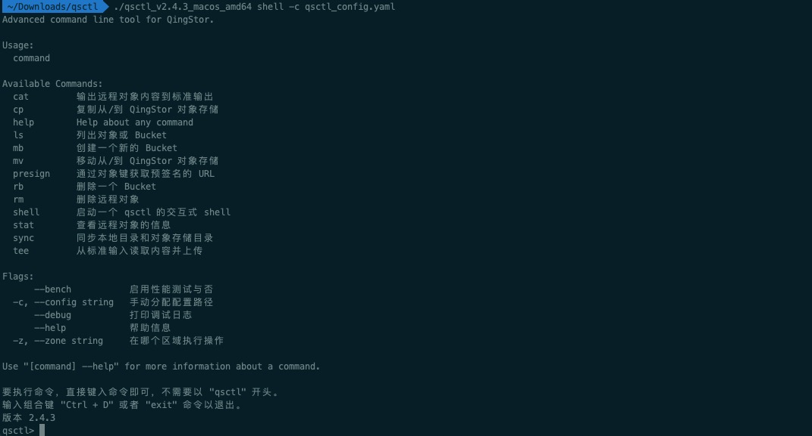

## 概述

qsctl 是 QingStor 对象存储提供的客户端高级命令行工具，用于管理 QingStor 对象存储资源。qsctl 提供了强大的类 UNIX 命令，所有的 qsctl 命令均支持批量操作。

目前 qsctl 已更新至 v2.4.3 版本，若您仍需查看 qsctl v1.x 版本的相关文档，请点击 [qsctl v1 文档](v1)。


## 安装

### 下载安装
1. 直接[点击此处](https://releases.qingstor.dev/#qsctl)，根据客户端操作系统版本，下载相应安装包。当前 qsctl 最新版本为 v2.4.3，若无特殊要求，建议下载最新版本。

 

2. 本地解压安装包后，即可运行：

 

### 修改配置

在正式使用 qsctl 工具前，用户需修改相应的配置文件，从而使其能正常工作。在载入配置文件时，qsctl 会按照如下顺序进行尝试，一旦读取成功便不再尝试下一个配置文件：

- 用户通过 `-c` 参数指定的配置文件
- 配置文件：`~/.qingstor/config.yaml`
- 配置文件：`~/.config/qingstor/config.yaml`
- 配置文件：`/etc/qingstor/config.yaml`

以上为类 Unix 系统下的配置文件路径，对于 Windows 用户而言，配置文件路径为 `C:\User\{\%USERPROFILE\%}\.qingstor\config.yaml`。

**详细操作步骤如下：**

1. 在 [管理控制台](https://console.qingcloud.com/access_keys/) 申请 API 密钥，并下载保存。

2. 根据前文信息，依次查看是否存在默认配置文件：

```bash
cat ~/.qingstor/config.yaml
cat ~/.config/qingstor/config.yaml
cat /etc/qingstor/config.yaml
```

3. 若以上文件均不存在，即说明无默认配置文件，需按照如下步骤手动创建配置文件：

```bash
touch qsctl_config.yaml
```

4. 按如下格式填写配置相关信息：

```yaml
access_key_id: 'ACCESS_KEY_ID_EXAMPLE'
secret_access_key: 'SECRET_ACCESS_KEY_EXAMPLE'

host: 'qingstor.com'
port: 443
protocol: 'https'
```

 **说明：**
   - `access_key_id` 与 `secret_access_key` 根据步骤 1 中下载的 API 密钥进行填写。
   - `host`，`port` 与 `protocol` 参数为待访问的 QingStor 对象存储的域名，端口号及协议类型。公有云维持默认即可，私有云环境需根据实际情况进行填写。
   - 配置文件默认使用 HTTPS 访问方式，若需修改为 HTTP 访问方式，可按照如下内容填写：

      ```yaml
      port: 80
      protocol: 'http'
      ```


## 升级

### 变更日志

详见 [qsctl changelog](https://github.com/qingstor/qsctl/blob/master/CHANGELOG.md)。

### 升级指南

QingStor 对象存储建议您升级至 qsctl v2.4.3 版本。详细操作步骤如下：

1. 执行如下命令行，删除历史版本的 qsctl ：

```bash
sudo pip uninstall qsctl
```

2. 参考上文安装配置 [qsctl](#安装)

### 兼容性说明

- 配置文件中，相关字段更新如下：
```bash
# 原字段
qs_access_key_id：
qs_secret_access_key：

# 更新为如下字段：
access_key_id：
secret_access_key：
```

- qsctl v2.4.3 不再从如下路径读取配置文件：
```bash
~/.qingcloud/config.yaml
```

- 对相关命令做出的变更说明如下：
<table>
  <tr>
    <th>命令</th>
    <th>说明</th>
  </tr>
  <tr>
    <td rowspan="2">cp，mv</td>
    <td>暂时取消对 include，exclude，--rate-limit 和 workers 选项的支持</td>
  </tr>
  <tr>
    <td>对本地文件夹的操作在路径结尾是否添加 `/` 时行为有所不同</td>
  </tr>
  <tr>
    <td rowspan="3">sync</td>
    <td>暂时取消对 include，exclude，--rate-limit 和 workers 选项的支持</td>
  </tr>
  <tr>
    <td>暂未添加对 --delete 选项的支持</td>
  </tr>
  <tr>
    <td>默认修改为非递归操作，如果需要递归同步子目录，请添加 -r 选项</td>
  </tr>
  <tr>
    <td>ls</td>
    <td>默认修改为只显示文件名的操作；如需显示详细信息，请添加 -l 选项</td>
  </tr>
  <tr>
    <td>rm</td>
    <td>暂时取消对 include，exclude，--rate-limit 和 workers 选项的支持</td>
  </tr>
</table>


## 使用

qsctl v2.2.0 中移除了之前添加的交互式的配置程序。若您仍需要进行交互式配置，建议使用 v2.1.2 版本。
v2.1.2 版本中，在您首次使用 qsctl 且未在默认目录下检索到配置文件时，便会启动该交互配置。您只需要根据命令行的提示输入或选择配置内容即可。配置完成后，配置程序会根据您输入的信息，在系统中生成如下配置文件：

```bash
{主目录}/.qingstor/config.yaml
```

 **说明：**
   - 具体的配置文件的位置会根据您的系统而有所不同。
   - 在类 Unix 操作系统下，配置文件会生成在 `~/.qingstor/config.yaml`。
   - 在 Windows 操作系统下，配置文件会生成在 `C:\User\{\%USERPROFILE\%}\.qingstor\config.yaml`。

### 命令列表
| 命令 | 描述 |
|-|-|
| cat | 输出远程对象内容至标准输出。|
| cp | 复制本地文件至 QingStor 对象存储的 Bucket，或从 QingStor 对象存储的 Bucket 复制对象至本地。|
| ls | 列出本用户下创建的所有 QingStor 对象存储的 Bucket，或列出给定 QingStor 对象存储的 Bucket 中给定前缀下的所有对象。|
| mb | 在 QingStor 对象存储服务端创建一个新的 Bucket。|
| mv | 移动本地文件至 QingStor 对象存储的 Bucket，或移动 QingStor 对象存储 Bucket 中的对象至本地。|
| presign | 生成 QingStor 对象存储的 Bucket 指定对象的临时下载链接。|
| rb | 从 QingStor 对象存储删除 Bucket。|
| rm | 从 QingStor 对象存储 Bucket 删除一个对象或给定前缀下的所有对象。|
| stat | 查看一个指定的 QingStor 对象存储的对象信息。|
| sync | 同步本地目录和 QingStor 对象存储目录。|
| tee | 从标准输入读取内容并上传至 QingStor 对象存储的 Bucket。|


### 查看帮助文件

1. 查看 qsctl 的命令列表和简易教程，可以通过 `-h` 参数打印出来:

```bash
qsctl -h
```

2. 查看 qsctl 的某个命令的详细说明和示例，请运行:

```bash
qsctl <command> --help
```

### 上传文件
1. 将本地文件上传至 QingStor 对象存储的 Bucket 中:

```bash
qsctl cp /path/to/file qs://mybucket/filename
```

 **说明：**
   - 若不指定 `-c` 参数，则使用默认配置文件。
   - 命令行中 `/path/to/file` 为本地待上传文件，需根据实际情况进行修改。
   - 命令行中 `qs://mybucket/filename` 为 QingStor 对象存储 Bucket 中文件路径，需根据实际情况进行修改。其中若不指定 `filename`，则上传后文件名根据源文件名创建；若指定 `filename`，则将源文件重命名为 `filename` 进行存储。

2. 将本地文件夹上传至 QingStor 对象存储的 Bucket 中:

```bash
$ qsctl cp /path/to/folder qs://mybucket/parent/ -r
```

3. 将本地文件夹下的所有文件上传至 QingStor 对象存储的 Bucket 中:
```bash
$ qsctl cp /path/to/folder/ qs://mybucket/parent/ -r
```

 **说明：**
   - 若待上传的对象是文件夹，则源文件为：`/path/to/folder`。
   - 若待上传的对象是文件夹下的所有内容，则源文件为：`/path/to/folder/`。需注意两者的区别。
   - `-r` 参数用于递归地复制文件夹及其子文件夹。所以使用该参数时，源路径与目标路径必须都是目录。


### 下载文件

执行如下命令行，从 QingStor 对象存储的 Bucket 中下载文件至本地:

```bash
qsctl cp qs://mybucket/filename /path/to/file
```

 **说明：**
   - 与上传文件至 QingStor 对象存储 Bucket 的区别在于源路径与目标路径的位置不同。
   - 其他用法均与上传文件至 QingStor 对象存储 Bucket 保持一致。

### 查看文件信息

`ls` 的结果不能保证有序，请勿依赖该命令来遍历显示顺序。

1. 列出该用户的所有 Bucket:
```bash
qsctl ls
```

2. 列出指定 Bucket `mybucket` 下的所有对象:
```bash
qsctl ls qs://mybucket -R
```

 **说明：**
   - `-R` 参数用于递归地显示文件夹及其子文件夹下的对象。
   - 若不指定`-R` 参数，Bucket 若有文件夹时，则仅显示文件夹名，不显示文件夹内的文件。
   - 输出内容如下所示：
   
   


3. 以列出指定 Bucket `mybucket` 下所有对象的详细信息:
```bash
qsctl ls qs://mybucket -lRh
```

 **说明：**
   - `-l` 参数用于显示文件的详细信息。
   - `-h` 参数用于转换文件的大小。
   - 输出内容如下所示：
   

### 移动文件

`mv` 操作与 `cp` 操作对文件夹与文件夹中的文件的处理逻辑相同， 请参考 [cp](#上传文件)。

### 查看统计信息

1. 查看指定 Bucket `mybucket` 的统计信息：
```bash
qsctl stat qs://mybucket
```
 **输出结果：**
 


2. 查看指定 QingStor 对象信息:
```bash
qsctl stat qs://mybucket/dir/to/test
```
 **输出结果：**
 


3. 查看指定 QingStor 对象信息，并自定义格式输出:
```bash
qsctl stat qs://mybucket/dir/to/test --format="name:%n, size:%s"
```
 **输出结果：**
 

 **说明：**`format` 参数用于传入格式化输出字符串。其中可用的有:
  - `%F` (文件类型)
  - `%h` (文件内容的 etag 信息)
  - `%n` (文件名)
  - `%s` (文件大小，单位为字节)
  - `%y` (最后一次数据修改的时间，显示为可读模式)
  - `%Y` (最后一次数据修改的时间，显示为 Unix 时间戳)


### 数据同步
`sync` 命令用于本地目录与 QingStor 对象存储目录的数据同步。故该操作的源路径与目标路径必须都是目录。由于 QingStor 对象存储没有目录概念，所以必须以 `/` 结尾。本地文件夹若为类 Unix 系统，须以 `/` 结尾；若为 Windows 系统请替换为 `\`。若本地文件夹不添加结尾字符，则系统会针对本地文件夹的父目录进行同步操作。

1. 同步 QingStor 对象存储目录至本地文件夹:
```bash
qsctl sync qs://mybucket/test/ /path/to/dir/ -r
```

2. 仅同步本地文件夹中更新的文件(不同步目标路径中不存在的文件):
```bash
qsctl sync . qs://mybucket/test/ -r --update --existing
```

 **说明：**
   - `--update` 参数用于指定仅同步源路径中(比目标路径)更新的文件。
   - `--existing` 参数用于指定仅复制已存在于目标目录中的文件。对于目标目录中不存在的文件，不做同步。
   - `--dry-run` 参数可用于显示哪些文件将会被同步(但并不真正执行同步操作)，用于确认，避免误操作。


### tee

从标准输入上传文件至 QingStor 对象存储。qsctl 将不会像 Linux tee 命令那样将内容绑定至标准输出。
```bash
cat /path/to/file | qsctl tee qs://mybucket/filename
```

### qsctl shell

自 qsctl v2.2.0 版本以来，QingStor 对象存储新加入了交互式的 shell 界面，包含更多的引导和提示信息，推荐新用户使用。若用户需使用 qsctl 开发脚本，建议直接使用前文介绍的命令模式。

QingStor 对象存储将所有命令执行中的交互都移动至 shell 中，包括进度条，删除 bucket 时的确认输入，删除 object 时的确认等。并在命令行直接执行时移除了这些交互效果，以便更好的支持用户使用脚本进行操作。除此之外，用户在终端与 qsctl shell 中输入同样指令所得到的结果是一致的。

1. 执行如下命令，进入命令行界面：
```bash
qsctl shell
```

2. 命令行界面如下下图所示：

 

3. 根据提示，进行相关操作即可。在命令行中，QingStor 对象存储新增了对历史命令和自动补全的支持。详细说明如下：
  - 在行开头可以自动提示补全可用命令；
  - 输入 `qs://` 可以自动提示补全用户的 Bucket 信息；
  - 空格后可以自动提示补全本地文件信息；
  - 输入 `-` 可以自动提示补全当前命令可用 flag 信息。
