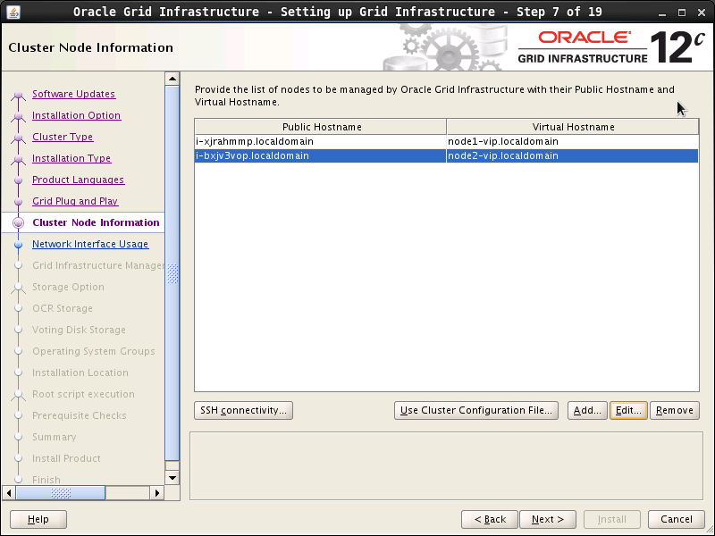
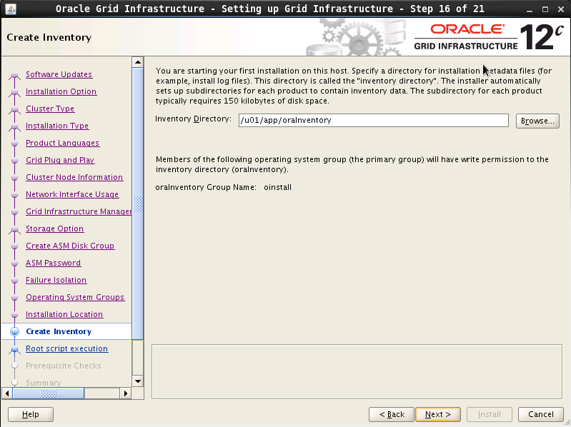

# 简介

通过青云的 SDS（软件定义存储）技术，您可以快速地搭建您专属的基于 iSCSI 协议的 Virtual SAN 服务。 首先需要创建一个 Virtual SAN 服务器；然后再在其上创建一个或多个目标； 最后在云服务器客户端登录这些目标即可使用。

本指南旨在介绍如何配置 Virtual SAN 和目标，以及如何设置客户端来访问 Virtual SAN。


> 注解
> 
> 如果将一块硬盘通过 Virtual SAN 服务挂载到多台云服务器上，那么必须通过分布式文件系统（Distributed File System）的支持才可以并行读写，可以使用青云已经推出的 [_NAS 服务_](https://docsv3.qingcloud.com/storage/vnas/manual/vnas) 。

## 创建 Virtual SAN 服务器

**操作步骤如下：**

1. 在控制台导航中点击**产品与服务** > **存储服务** > **共享存储**  > **Virtual SAN**进入列表页面。

2. 点击**创建**按钮开始创建。进入如下页面：

   

3. 设置如下基本信息。

| <div style="width: 50pt">参数名称</div>       | 参数说明                                                     |
| ---------- | ------------------------------------------------------------ |
| 名称               | Virtual SAN 服务器的名称。 |
| 类型              | 支持基础性和企业型。 <li>基础型 VSAN 服务使用的云服务器类型为基础型的云服务器，是面向个人或中小团队用户推出的入门型共享块存储服务，满足低负载的共享存储服务的场景需求。基础型 VSAN 服务可以使用基础型硬盘，容量型硬盘和企业级分布式 SAN 硬盘 (NeonSAN) 。</li><li>企业型 VSAN 服务使用的云服务器类型为企业型的云服务器，是面向性能要求更高的的企业级生产应用环境设计的高性能高可靠共享块存储服务，满足企业客户关键业务使用场景的存储需求。企业型 VSAN 服务可以使用 SSD 企业型硬盘，容量型硬盘和企业级分布式 SAN 硬盘 (NeonSAN) 。</li>|
| VPC网络            |  根据实际情况选择。如需创建新的VPC网络，点击**新建VPC网络**，即可跳转至相应页面进行创建。                          |
| 私有网络          | 根据实际情况选择。如需创建新的私有网络，点击**新建私有网络**，即可跳转至相应页面进行创建。 <div style="background-color: #D8ECDE; padding: 10px 24px; margin: 10px 0; border-left: 3px solid #00a971;"><b>说明</b>：<br>需要确保所选私有网络的 DHCP 处于**打开**状态。</div> |
| 可用区           |   根据实际情况选择。                         |
| 工作模式        |  支持单节点和集群。 <br /> 集群模式可用于客户端 HA 和负载均衡，目前共享目标硬盘仅支持企业级分布式 SAN（NeonSAN）。 |
| 节点数量         |  工作模式设置为**集群**时需设置该参数。根据实际情况设置。支持范围为：2~10。                        |
| IP        |   支持自动分配和手动指定。根据实际情况设置。                        |

## 创建目标

**操作步骤如下：**

1. 点击创建成功的 Virtual SAN 服务器。 进入 Virtual SAN 服务器的详细信息页面，点击 **创建目标门户组**，进入如下界面。


| <div style="width: 50pt">参数名称</div> | 参数说明                                                     |
| --------------------------------------- | ------------------------------------------------------------ |
| 目标类型                                | 默认为iSCSI。                                                |
| iSCSI标识                               | 根据实际情况为目标指定 iSCSI 标识，也可以输入一个短名（中间不允许有空格，下划线等），青云会自动帮您生成合法的 iSCSI 标识。<br /> 格式是：“iqn” + “.” + “年月” + “.” + “域名的颠倒” + “:” + “设备的具体名称”，颠倒域名是为了避免可能的冲突。 |

2. 创建成功后，点击**添加存储**，进入如下界面。


3. 添加 iSCSI 客户端（可选）。在Virtual SAN 服务器的详细信息页面，点击**操作** > **设置iSCSI客户端**，进入如下界面。

   为了 Virtual SAN 的安全性，可以指定 iSCSI 客户端登录到目标，即设置 iSCSI 客户端的 initiator name。


4. 创建完成后，点击**应用修改**。Virtual SAN 服务端即设置完成。

## 配置 iSCSI 客户端

该部分主要讲述如何在 Linux 和 Windows 两种操作系统上配置 iSCSI 客户端来访问 Virtual SAN。

### Linux

**安装客户端软件**

```
Redhat/Centos: yum install -y iscsi-initiator-utils
Debian/Ubuntu: apt-get install open-iscsi
```

**配置 initiator name**

编辑 ``/etc/iscsi/initiatorname.iscsi``，加入 ``InitiatorName``。 如果您在配置目标时设置了 iSCSI 客户端的 initiator name，请保证这两个名称一致，否则后面的登录操作会失败。

```
InitiatorName=iqn.1993-08.org.debian:01:967eaffe29d7
```

> 注解
> 
> 可以用 iscsi-iname 命令生成一个 initiator name，例如：

```
iscsi-iname （以缺省前缀生成名称）
iscsi-iname -p iqn.2005-03.com.qingcloud （以指定的前缀生成名称）
```

**发现目标**

默认情况下，iSCSI 发起方和目标方之间通过端口3260连接。

> 注解
> 
> iSCSI 命令需要以 root 身份运行（下同）。

```
iscsiadm -m discovery -t st -p <Virtual SAN 服务器IP>
iscsiadm -m node
```

iSCSI 发起方和目标方建立连接以后，可以进行登录节点操作。

**登录到目标**

```
iscsiadm -m node -T <目标IQN>  -p  <Virtual SAN 服务器IP>  --login
iscsiadm -m session
```

完成上述步骤后，当你执行 lsblk 命令时你可以发现本地多了一块或多块硬盘， 你可以像本地硬盘一样使用它（们）。

> 注解
> 
> 如果你想在客户端重启时自动登录，请执行下面的命令：

```
iscsiadm -m node -T <目标IQN>  -p  <Virtual SAN 服务器IP> --op update -n node.startup -v automatic
```

**卸载、登出、删除目标**

```
umount /data (/data是共享存储挂载的目录)
iscsiadm -m node -T  <目标IQN>   -p <Virtual SAN 服务器IP> --logout
iscsiadm -m node -T <目标IQN> -p  <Virtual SAN 服务器IP> --op=delete
```

> 注解
> 
> 如果你想登出所有的目标，请执行下面的命令：

```
iscsiadm -m node --logout
```

### Windows

**客户端软件**

在 Windows Server 2008 R2 中，可以通过执行以下操作之一访问 Microsoft iSCSI initiator 的界面：


*   依次单击『开始』、『控制面板』和『经典视图』，然后单击 『iSCSI initiator』。
*   依次单击『开始』、『管理工具』，然后单击 『iSCSI initiator』。

在 Windows 7 中，可以通过执行以下操作之一访问 Microsoft iSCSI initiator 的界面：

*   依次单击『开始』、『控制面板』，在搜索字段中键入 iSCSI，然后在『管理工具』中单击『iSCSI initiator』。

**发现目标**

*   点击程序的发现页面，然后点击『发现门户...』。
*   在弹出的窗口中，可以输入服务器地址。
*   然后转到目标器页面，这是会自动显示服务器的所有有效 target。


**登录到目标**

转到目标器页面，选中之前创建的目标，然后，点击连接。

> 注解
> 
> 默认勾选“将此连接添加到收藏目标列表”，意思就是，系统启动会自动连接存储设备。

点击确定，就能够连接，然后我们就可以像操作普通磁盘一样，对其格式化，分区等等。

## 公网访问 Virtual SAN

由于通过公网访问 Virtual SAN 的 IO 延迟比较大，通常情况下不建议以这种方式访问。 如果你有一些特殊的场景需要公网访问，除了按照前面的指南操作之外，还需要修改客户端的配置文件。

```
vi /var/lib/iscsi/nodes/<目标IQN>/<Virtual SAN 服务器IP>/default
```

在该文件里把node.conn[0].address从私网 IP 改成公网 IP 即可。

## 部署 Oracle RAC

青云提供的 Virtual SAN 比较典型的应用场景就是 Oracle RAC。以下介绍如何在青云上部署这样的服务。

### Oracle RAC 部署拓扑

一个典型的 Oracle RAC 由多个数据库节点和共享硬盘组成。DB 客户端使用 scan-cluster 域名访问数据，负载均衡由 Oracle 自己控制。


### 安装前准备

**云服务器**

*   基于 Oracle Linux 6.6 镜像
*   其中两台（node1, node2）作为 oracle 数据库节点，至少2核8G
*   加入连接了路由器的私有网络

> 注解
> 
> 本文为了简化部署拓扑，只使用两个节点。请根据自己的项目需求决定数据库节点数量。

**性能型硬盘**

*   4块通过 Virtual SAN 提供共享存储, 用于部署数据库，具体大小看业务需求
*   1块用于存放安装文件，大小10G

**Oracle 安装文件**

*   本文档使用的安装文件具体如下：


*   [Oracle Database 12c Release 1 (12.1.0.1.0)](http://www.oracle.com/technetwork/database/enterprise-edition/downloads/database12c-linux-download-1959253.html)
*   [Oracle Grid Infrastructure 12c Release 1 (12.1.0.1.0)](http://www.oracle.com/technetwork/database/database-technologies/clusterware/downloads/index.html)

### 网络配置

Oracle RAC 需要云服务器加入两个网络，分别用于对外提供服务，和对内数据同步。在青云可以让云服务器同时加入受管，和自管私有网络来满足这个要求。

**网络规划**

| 节点 | 受管网络地址 | 自管网络地址 | VIP |
| --- | --- | --- | --- |
| node1 | 192.168.100.2 | 172.16.100.2 | 192.168.100.102 |
| node2 | 192.168.100.3 | 172.16.100.3 | 192.168.100.103 |
| scan-cluster IP | 192.168.100.210 | n/a | n/a |

其中scan-cluster IP 并不是云服务器，只是一个配置了 DNS 域名解析的 IP 地址，作用类似 VIP。在这个例子里面，我们把 Oracle RAC 的域名定为“scan-cluster.localdomain”, 您需要把它替换成适合自己的名字。

由于需要预留一些 IP 段，请修改路由器 DHCP 配置，减少自动分配的 IP 段。具体操作是:

1.  打开青云路由器
2.  点击“关闭DHCP服务”，并再次启动
3.  弹出对话框如图。把254改成100, 然后提交


> 注解
> 
> 这里推荐修改 DHCP 服务范围为2~100是为了方便配置数据库节点的 VIP, 比如 192.168.100.3对应的 VIP 可以是192.168.100.103。

**配置云服务器网络和地址**

用户需要在青云中做如下操作:

1.  云服务器 node1 和 node2 加入连接了路由器的受管私有网络（通常这一步创建云服务器时已经完成)
2.  点击私有网络–创建， 在对话框中点击高级选项 ，选择“自管”，创建一个新的自管网络
3.  右击私有网络–添加云服务器。把两个云服务器加到自管网络中

加入所需的网络后，需要到云服务器的桌面上配置下自管网络的 IP 地址


> 注解
> 
> 1.  Oracle Linux自带的 NetworkManage 会覆盖命令行对 IP 地址的修改，最好使用桌面配置 IP。
> 2.  截图里面172.16.100.1这个地址实际不存在，只是为了让配置有效。
> 3.  先加入受管网络，再加入自管网络。这是为了让自管网络对应网卡成为 eth1, 这样默认网关就是 eth0 对应的网关，也就是受管网络路由器。

**配置私网 DNS 域名**

Oracle RAC 对外提供的地址是 scan-cluster 域名，Oracle 会管理 scan-cluster IP 地址，但是要求它能被 DNS 解析。青云路由器提供了私网 DNS 功能，可以方便地在私网里面定义 DNS 记录，用于配置 scan-cluster 域名。

启动私网DNS，并为scan-cluster和每个节点定义私网域名。


> 注解
> 
> 其中i-xjrahmmp和i-bxjv3vop是node1和node2的机器名。如果需要用自定义的机器名，请使用 [*](#id7).localdomain的格式，比如: node1.localdomain

应用路由器修改后，如果是第一次启用私网 DNS 功能，需要等待一会儿，或者重启 network-manager 服务，让云服务器从 DHCP 更新 DNS 服务器 IP 地址，然后到node1/node2上面测试 DNS 记录是否可用:

```
# yum install bind-utils -y
# nslookup 192.168.100.210
Server:               192.168.100.200#53
Address:      192.168.100.200#53

210.100.168.192.in-addr.arpa  name = scan-cluster.localdomain.

# nslookup scan-cluster.localdomain
Server:               192.168.100.200
Address:      192.168.100.200#53

Name: scan-cluster.localdomain
Address: 192.168.100.210
```

**修改/etc/hosts**

Grid安装包会从 ``/etc/hosts`` 里面找当前节点名字，在 ``/etc/hosts`` 文件的 ``127.0.0.1`` 这一行结尾添加云服务器名字，比如``i-xjrahmmp i-xjrahmmp.localdomain`` 修改后，内容如下：

```
# cat /etc/hosts
127.0.0.1   localhost localhost.localdomain localhost4 localhost4.localdomain4 i-xjrahmmp i-xjrahmmp.localdomain
```

### 创建用户、修改用户配置文件

**配置用户** 配置 RAC 的时候需要安装 Oracle grid infrastructure、Oracle 数据库软件、其中 grid 是一个集群件，需要共享存储。oracle建议以不同的用户分别安装 grid 和数据库软件，这里以 grid 用户安装 grid 软件、oracle 用户安装 oracle 数据库软件。并且 grid、oracle 用户需要属于不同的用户组。在配置 rac 时，还要求这两个用户在不同的节点上 uid、gid 要一致。

在两个节点分别运行以下命令:

```
GRID_PW=grid
ORACLE_PW=oracle
groupadd -g 1000 oinstall
groupadd -g 1200 asmadmin
groupadd -g 1201 asmdba
groupadd -g 1202 asmoper
useradd -u 1100 -g oinstall -G asmadmin,asmdba,asmoper -d /home/grid -s /bin/bash -c "grid Infrastructure Owner" grid
echo "$GRID_PW" | passwd --stdin grid

echo 'export PS1="`/bin/hostname -s`-> "'>> /home/grid/.bash_profile
echo "export TMP=/tmp">> /home/grid/.bash_profile
echo 'export TMPDIR=$TMP'>>/home/grid/.bash_profile
echo "export ORACLE_SID=+ASM1">> /home/grid/.bash_profile
echo "export ORACLE_BASE=/u01/app/grid">> /home/grid/.bash_profile
echo "export ORACLE_HOME=/u01/app/11.2.0/grid">> /home/grid/.bash_profile
echo "export ORACLE_TERM=xterm">> /home/grid/.bash_profile
echo "export NLS_DATE_FORMAT='yyyy/mm/dd hh24:mi:ss'" >> /home/grid/.bash_profile
echo 'export TNS_ADMIN=$ORACLE_HOME/network/admin'  >> /home/grid/.bash_profile
echo 'export PATH=/usr/sbin:$PATH'>> /home/grid/.bash_profile
echo 'export PATH=$ORACLE_HOME/bin:$PATH'>> /home/grid/.bash_profile
echo 'export LD_LIBRARY_PATH=$ORACLE_HOME/lib:/lib:/usr/lib'>> /home/grid/.bash_profile
echo 'export CLASSPATH=$ORACLE_HOME/JRE:$ORACLE_HOME/jlib:$ORACLE_HOME/rdbms/jlib'>> /home/grid/.bash_profile
echo "export EDITOR=vi" >> /home/grid/.bash_profile
echo "export LANG=en_US" >> /home/grid/.bash_profile
echo "export NLS_LANG=american_america.AL32UTF8" >> /home/grid/.bash_profile
echo "umask 022">> /home/grid/.bash_profile

groupadd -g 1300 dba
groupadd -g 1301 oper
useradd -u 1101 -g oinstall -G dba,oper,asmdba -d /home/oracle -s /bin/bash -c "Oracle Software Owner" oracle
echo "$ORACLE_PW" | passwd --stdin oracle

echo 'export PS1="`/bin/hostname -s`-> "'>> /home/oracle/.bash_profile
echo "export TMP=/tmp">> /home/oracle/.bash_profile
echo 'export TMPDIR=$TMP'>>/home/oracle/.bash_profile
echo "export ORACLE_HOSTNAME=node1.localdomain">> /home/oracle/.bash_profile
echo "export ORACLE_SID=devdb1">> /home/oracle/.bash_profile
echo "export ORACLE_BASE=/u01/app/oracle">> /home/oracle/.bash_profile
echo 'export ORACLE_HOME=$ORACLE_BASE/product/11.2.0/db_1'>> /home/oracle/.bash_profile
echo "export ORACLE_UNQNAME=devdb">> /home/oracle/.bash_profile
echo 'export TNS_ADMIN=$ORACLE_HOME/network/admin'  >> /home/oracle/.bash_profile
echo "export ORACLE_TERM=xterm">> /home/oracle/.bash_profile
echo 'export PATH=/usr/sbin:$PATH'>> /home/oracle/.bash_profile
echo 'export PATH=$ORACLE_HOME/bin:$PATH'>> /home/oracle/.bash_profile
echo 'export LD_LIBRARY_PATH=$ORACLE_HOME/lib:/lib:/usr/lib'>> /home/oracle/.bash_profile
echo 'export CLASSPATH=$ORACLE_HOME/JRE:$ORACLE_HOME/jlib:$ORACLE_HOME/rdbms/jlib'>> /home/oracle/.bash_profile
echo "export EDITOR=vi" >> /home/oracle/.bash_profile
echo "export LANG=en_US" >> /home/oracle/.bash_profile
echo "export NLS_LANG=american_america.AL32UTF8" >> /home/oracle/.bash_profile
echo "export NLS_DATE_FORMAT='yyyy/mm/dd hh24:mi:ss'" >> /home/oracle/.bash_profile
echo "umask 022">> /home/oracle/.bash_profile
id grid
id oracle
```

> 注解
> 
> 生成环境请修改代码中的密码。

脚本执行后会输出 uid/gid, 请比较两个节点，看是否如下：

```
uid=1100(grid) gid=1000(oinstall) groups=1000(oinstall),1200(asmadmin),1201(asmdba),1202(asmoper)
uid=1101(oracle) gid=1000(oinstall) groups=1000(oinstall),1201(asmdba),1300(dba),1301(oper)
```

**创建软件安装目录、改权限**

在两个节点分别运行以下命令

```
mkdir -p /u01/app/grid
mkdir -p /u01/app/11.2.0/grid
mkdir -p /u01/app/oracle
chown -R oracle:oinstall /u01
chown -R grid:oinstall /u01/app/grid
chown -R grid:oinstall /u01/app/11.2.0
chmod -R 775 /u01
```

**修改/etc/security/limits.conf**

在两个节点分别运行以下命令

```
cp /etc/security/limits.conf /etc/security/limits.conf.bak
echo "oracle soft nproc 2047" >>/etc/security/limits.conf
echo "oracle hard nproc 16384" >>/etc/security/limits.conf
echo "oracle soft nofile 1024" >>/etc/security/limits.conf
echo "oracle hard nofile 65536" >>/etc/security/limits.conf
echo "grid soft nproc 2047" >>/etc/security/limits.conf
echo "grid hard nproc 16384" >>/etc/security/limits.conf
echo "grid soft nofile 1024" >>/etc/security/limits.conf
echo "grid hard nofile 65536" >>/etc/security/limits.conf
```

**修改 /etc/pam.d/login 配置文件**

在两个节点分别运行以下命令

```
cp /etc/pam.d/login /etc/pam.d/login.bak
echo "session required /lib/security/pam_limits.so" >>/etc/pam.d/login
echo "session required pam_limits.so" >>/etc/pam.d/login
```

**修改 /etc/profile文件**

在两个节点分别运行以下命令

```
cp /etc/profile /etc/profile.bak
echo 'if [ $USER = "oracle" ]||[ $USER = "grid" ]; then' >>  /etc/profile
echo 'if [ $SHELL = "/bin/ksh" ]; then' >> /etc/profile
echo 'ulimit -p 16384' >> /etc/profile
echo 'ulimit -n 65536' >> /etc/profile
echo 'else' >> /etc/profile
echo 'ulimit -u 16384 -n 65536' >> /etc/profile
echo 'fi' >> /etc/profile
echo 'fi' >> /etc/profile
```

**修改内核配置文件**

在两个节点分别运行以下命令

```
cp /etc/sysctl.conf /etc/sysctl.conf.bak
echo "fs.aio-max-nr = 1048576" >> /etc/sysctl.conf
echo "fs.file-max = 6815744" >> /etc/sysctl.conf
echo "kernel.shmall = 2097152" >> /etc/sysctl.conf
echo "kernel.shmmax = 1054472192" >> /etc/sysctl.conf
echo "kernel.shmmni = 4096" >> /etc/sysctl.conf
echo "kernel.sem = 250 32000 100 128" >> /etc/sysctl.conf
echo "net.ipv4.ip_local_port_range = 9000 65500" >> /etc/sysctl.conf
echo "net.core.rmem_default = 262144" >> /etc/sysctl.conf
echo "net.core.rmem_max = 4194304" >> /etc/sysctl.conf
echo "net.core.wmem_default = 262144" >> /etc/sysctl.conf
echo "net.core.wmem_max = 1048586" >> /etc/sysctl.conf
echo "net.ipv4.tcp_wmem = 262144 262144 262144" >> /etc/sysctl.conf
echo "net.ipv4.tcp_rmem = 4194304 4194304 4194304" >> /etc/sysctl.conf
sysctl -p
```

**停止 NTP 服务，否则安装的时候检查环境会通不过**

在两个节点分别运行以下命令

```
service ntpd stop
chkconfig ntpd off
rm -f /etc/ntp.conf
```

**配置 oracle grid 用户 ssh 的对等性**

就是在grid和oracle用户下创建密钥，上传公钥，两个用户的节点间互访都不需要密码，具体操作自行处理。 请分别以grid和oracle用户运行下面命令：

```
sed -i 's/UserKnownHostsFile \/dev\/null//g' /etc/ssh/ssh_config
sed -i 's/StrictHostKeyChecking no/StrictHostKeyChecking ask/g' /etc/ssh/ssh_config
ssh-keygen -N "" -f ~/.ssh/id_rsa
ssh-keygen -N "" -y -f ~/.ssh/id_rsa > ~/.ssh/id_rsa.pub
cat ~/.ssh/id_rsa.pub
```

这里需要手动把生成的公钥都加到node1/node2的～/.ssh/authorized_keys里面，再分别到node1和node2以grid和oracle用户执行下面命令:

```
INSTANCE_ID_NODE1=i-xjrahmmp
INSTANCE_ID_NODE2=i-bxjv3vop
ssh $INSTANCE_ID_NODE1 date
ssh $INSTANCE_ID_NODE2 date
ssh $INSTANCE_ID_NODE1.localdomain date
ssh $INSTANCE_ID_NODE2.localdomain date
ssh node1-priv date
ssh node2-priv date
ssh node1-priv.localdomain date
ssh node2-priv.localdomain date
```

> 注解
> 
> 请替换里面的``i-xjrahmmp``和``i-bxjv3vop``为node1|node2的云服务器id。node1除了信任node2, 还要信任自己，反之也是。请多次运行以上命令，直到能正确返回时间，并且不再提示“RSA key fingerprint...Are you sure you want...”

### 存储配置

本例共需要5块性能型硬盘，1块本地硬盘用于存储数据库安装文件，4块共享存储。对应本地硬盘，请挂载到node1上面，并拷贝和解压安装文件。

> 注解
> 
> 对于您具体需要多少块共享硬盘，和具体的大小，请咨询 dba

创建并挂载共享存储，请参考 [_Virtual SAN 指南_](#guide-s2) 。将 4 块硬盘全部加载到 node1 和 node2 ， 然后把那块本地硬盘挂到 node1。挂完之后，node1 应该是这样子(其中 vdc 是本地硬盘):

```
# lsblk
NAME   MAJ:MIN RM SIZE RO TYPE MOUNTPOINT
sda      8:0    0  10G  0 disk
sdb      8:16   0  10G  0 disk
sdc      8:32   0  10G  0 disk
sdd      8:48   0  10G  0 disk
vda    251:0    0  20G  0 disk
└─vda1 251:1    0  20G  0 part /
vdb    251:16   0   8G  0 disk [SWAP]
vdc    251:32   0  10G  0 disk
└─vdc1 251:33   0  10G  0 part
```

运行下面命令创建配置文件``99-oracle-asmdevices.rules``

```
echo "options=--whitelisted --replace-whitespace">/etc/scsi_id.config
rm -f /etc/udev/rules.d/99-oracle-asmdevices.rules
i=1
id=''
for x in a b c d
  do
    id=`scsi_id --whitelisted --replace-whitespace --device=/dev/sd$x`
    echo "KERNEL==\"sd*\", SUBSYSTEM==\"block\", PROGRAM==\"/sbin/scsi_id --whitelisted --replace-whitespace --device=/dev/\$name\", RESULT==\"$id\", NAME=\"asm-disk$i\",  OWNER=\"grid\",  GROUP=\"asmadmin\", MODE=\"0660\"">>/etc/udev/rules.d/99-oracle-asmdevices.rules
    let i++
  done
/sbin/start_udev
```

> 注解
> 
> 以上代码中，”a b c d”代表加载的共享硬盘 sda~sdd 。请根据实际情况修改。硬盘必须是新硬盘（无分区，没有被格式化），否则 Grid 无法安装。

检查udev是否正常配置

```
# ll /dev/asm*
brw-rw---- 1 grid asmadmin 8, 48 3月  12 21:15 /dev/asm-disk1
brw-rw---- 1 grid asmadmin 8, 16 3月  12 21:20 /dev/asm-disk2
brw-rw---- 1 grid asmadmin 8, 32 3月  12 21:20 /dev/asm-disk3
brw-rw---- 1 grid asmadmin 8, 48 3月  12 21:20 /dev/asm-disk4
```

安装依赖包

```
yum install -y sysstat libstdc++-devel libaio-devel gcc-c++ compat-libstdc++-33 elfutils-libelf-devel smartmontools compat-libcap1 ksh nfs-utils
```

到这里，环境准备结束，可以开始安装软件了。

### 安装 Oracle 软件

请把安装文件下载并解压到 node1的/mnt/vdc 目录。应该是这个样子：

```
[root@i-xjrahmmp vdc]# ll
total 4531520
drwxr-xr-x 7 root root       4096 7月   7 2014 database
drwxr-xr-x 7 root root       4096 6月  10 2013 grid
-rw-r--r-- 1 root root 1361028723 3月  12 11:51 linuxamd64_12c_database_1of2.zip
-rw-r--r-- 1 root root 1116527103 3月  12 11:37 linuxamd64_12c_database_2of2.zip
-rw-r--r-- 1 root root 1750478910 3月  11 19:52 linuxamd64_12c_grid_1of2.zip
-rw-r--r-- 1 root root  201673595 3月  11 19:52 linuxamd64_12c_grid_2of2.zip
drwx------ 2 root root      16384 3月  11 19:38 lost+found
```

**安装前预检查配置信息**

oracle grid infrastructure 提供了一个脚本，检查，并修复环境问题。请在 node1 执行下面命令（请替换 i-xjrahmmp,i-bxjv3vop 为实际用的 instance id ）:

```
su - grid
cd /mnt/vdc/grid
./runcluvfy.sh stage -pre crsinst -n i-xjrahmmp,i-bxjv3vop -fixup -verbose
```

通常会检查出一些问题，oracle 自动会给我们提供修复脚本，例如修复用户组，内核参数什么的。第一次运行会提示：

```
Press ENTER key to continue after execution of "/tmp/CVU_12.1.0.1.0_grid/runfixup.sh" has completed on nodes "i-xjrahmmp,i-bxjv3vop"
```

表示需要以 root 用户在节点” i-xjrahmmp,i-bxjv3vop” 上面运行 /tmp/CVU_12.1.0.1.0_grid/runfixup.sh。 运行完成后，回到这个 terminal, 按回车键。

修复完后再次检查，如果还是有问题，请自己查看是否有 fail 的地方，并自行解决。如果执行了本文提供的所有操作，是不会有问题的。

**安装 Grid Infrastructure**

从此步骤开始正式安装 Grid 软件，请使用青云的 web terminal 登录 node1 的桌面，执行以下安装步骤。

以 grid 用户登录图形界面，执行 “grid/runInstaller”进入 OUI 图形安装界面。请按以下截图选择:




由于 Grid安装包从/etc/hosts 中读取本地节点 (Local node) 名字，跟系统设置可能不匹配。如果提示 [INS-40907] Local node not included in the list of host names for grid installation 错误，请检查是否完成了本文“修改 /etc/hosts” 一节所需的配置。


如果 VSAN 挂载的硬盘已经被分区或者格式化，Grid 安装包会忽略所有 VSAN 的硬盘，导致硬盘列表里面不显示硬盘。请确保挂载的硬盘都是新硬盘。





这一步会再次检查环境。会发现两个问题，点 “fix & check again”按钮，会得到提示，在两个节点上面用 root 运行一个脚本。请按提示执行，然后重新检查环境。


> 注解
> 
> grid 安装环境检查脚本在 Oracle Linux 6 上面的一个 bug 导致错误” PRVF-9802” 无法解决，具体原因请见 [Debug Cluvfy error ERROR: PRVF-9802](http://www.hhutzler.de/blog/debug-cluvfy-error-error-prvf-9802/) 。

为了继续安装，请勾上”Ingore All”忽略这个错误，然后下一步。


安装到 79% 时，会提示以root用户到两个节点运行脚本。这里必须从 node1 开始执行，全部执行完了，然后再去 node2 执行。其中第二个脚本需要十多分钟的时间执行。


脚本执行完成后，到安装界面继续，并完成安装。安装完成后，以 grid 用户运行下面命令确认集群已启动

```
-> crs_stat -t
Name           Type           Target    State     Host
------------------------------------------------------------
ora....SM.lsnr ora....er.type ONLINE    ONLINE    i-bxjv3vop
ora.DATA.dg    ora....up.type ONLINE    ONLINE    i-xjrahmmp
ora....ER.lsnr ora....er.type ONLINE    ONLINE    i-bxjv3vop
ora....N1.lsnr ora....er.type ONLINE    ONLINE    i-xjrahmmp
ora.MGMTLSNR   ora....nr.type ONLINE    ONLINE    i-xjrahmmp
ora.asm        ora.asm.type   ONLINE    ONLINE    i-xjrahmmp
ora.cvu        ora.cvu.type   ONLINE    ONLINE    i-xjrahmmp
ora....OP.lsnr application    ONLINE    ONLINE    i-bxjv3vop
ora....vop.ons application    ONLINE    ONLINE    i-bxjv3vop
ora....vop.vip ora....t1.type ONLINE    ONLINE    i-bxjv3vop
ora....MP.lsnr application    ONLINE    ONLINE    i-xjrahmmp
ora....mmp.ons application    ONLINE    ONLINE    i-xjrahmmp
ora....mmp.vip ora....t1.type ONLINE    ONLINE    i-xjrahmmp
ora.mgmtdb     ora....db.type ONLINE    ONLINE    i-xjrahmmp
ora....network ora....rk.type ONLINE    ONLINE    i-bxjv3vop
ora.oc4j       ora.oc4j.type  ONLINE    ONLINE    i-xjrahmmp
ora.ons        ora.ons.type   ONLINE    ONLINE    i-bxjv3vop
ora.proxy_advm ora....vm.type ONLINE    OFFLINE
ora.scan1.vip  ora....ip.type ONLINE    ONLINE    i-xjrahmmp
```

> 注解
> 
> 在 12c 版本中， ora.proxy_advm 被用到时才会启动，所以安装完显示为 OFFLINE ,并不代表出了问题。

**安装 oracle 数据库软件**

以 oracle 用户登录，执行 database/runInstaller 进入图形安装界面。


然后开始安装，最后也会提示用 root 用户身份在两个节点执行脚本，执行完后结束安装。

**创建 asm 磁盘组**

以 grid 用户创建 asm 磁盘组，创建的磁盘组为 Oracle 数据库提供存储。

1.  以 grid 用户登录图形界面，执行 asmca
2.  Disk Groups ,Create 创建新的磁盘组
3.  输入名称G1，冗余选external，磁盘选择asm-disk3，ok
4.  继续创建磁盘组，名称FLASH，冗余选external，磁盘选asm-disk4，ok （这个创建的是闪回恢复区-Flash Recovery Area，大小问DBA如何规划）
5.  至此，3个磁盘组全部被RAC mount

**创建 rac 数据库**

以 oracle 用户登录图形界面，执行 dbca ，进入 DBCA 图形界面


下一步选中创建 sample schema ， 然后后面几步全部默认，完成数据库创建。

**测试数据库是否正常**

使用 oracle 用户运行 sqlplus 就能连接数据库。输入用户名（system）和安装时定义的密码后，应该能进入 sql terminal 。可以试一下能否运行 sql 语句

```
SQL> CREATE TABLE users;
(
    user_id varchar(255) PRIMARY KEY NOT NULL,
    user_name varchar(255) NOT NULL
);  2    3    4    5

Table created.
SQL> drop table users;

Table dropped.
```
